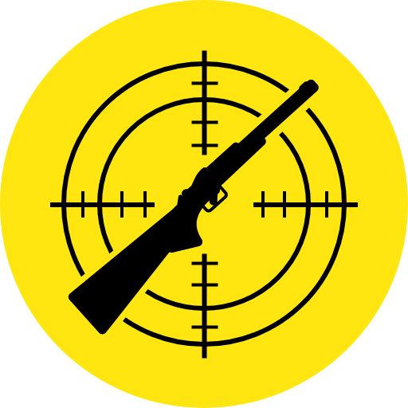

# Jachtterrein

Het aaneengesloten geheel van gronden waarop een jager het jachtrecht heeft, noemen we het jachtterrein. Afhankelijk van het soort jacht mag een jachtterrein kleiner of groter zijn. Om te mogen jagen met een vuurwapen moet een jager over een jachtterrein van minstens 40 hectare beschikken. Voor de jacht op waterwild volstaat een gebied van minstens 3 hectare water.

Een jager die op een andere manier jaagt, bijvoorbeeld met roofvogels of met fret en buidel, hoeft zich niet aan een minimumoppervlakte te houden. Een uitbreiding of betwisting van het jachtterrein gebeurt met een schriftelijke overeenkomst. 

Naast de minimale oppervlakte gelden er voor jachtterreinen nog enkele extra regels:
- In het jachtterrein mag geen autosnelweg, bevaarbare waterloop of spoorweg liggen
- Jagers mogen binnen een afstand van 150 meter van huizen niet schieten in de richting van die huizen
- Een jager moet elk jaar een jachtplan van zijn jachtterrein indienen

