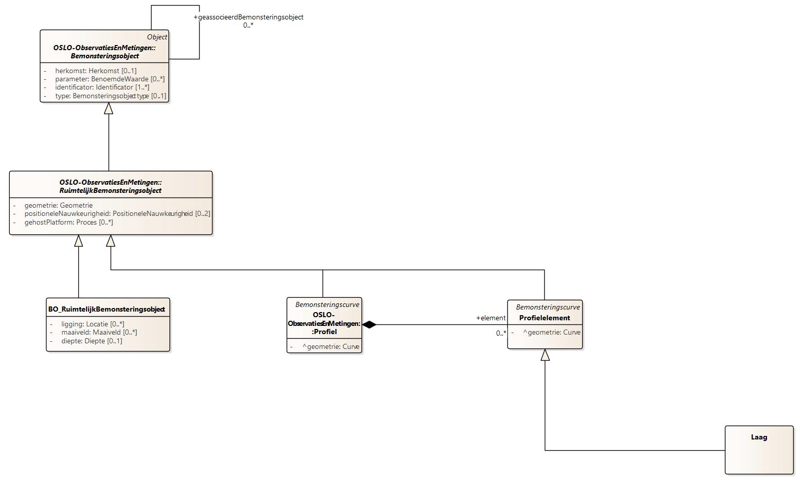

## OSLO model Bodem en ondergrond

Via het [OSLO model Sensoren-en-bemonstering](https://data.vlaanderen.be/doc/applicatieprofiel/sensoren-en-bemonstering/kandidaatstandaard/2022-04-28/html/overview.jpg) en 
het [OSLO model bodem en ondergrond](https://data.vlaanderen.be/doc/applicatieprofiel/bodem-en-ondergrond/bodem-en-ondergrond/kandidaatstandaard/2022-04-28/) wordt het mogelijk om de dataset LUCAS te beschrijven.

