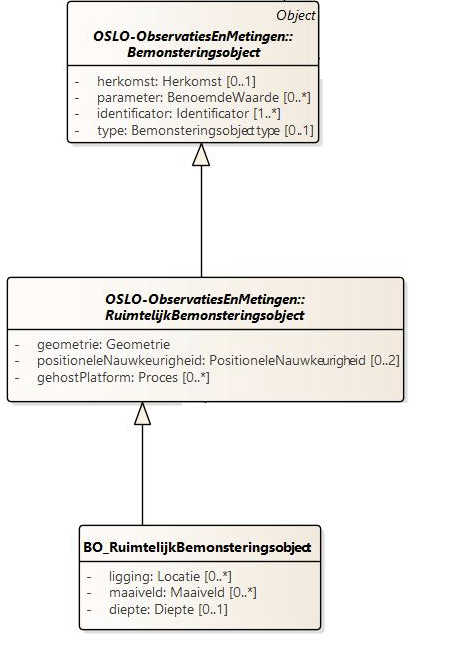
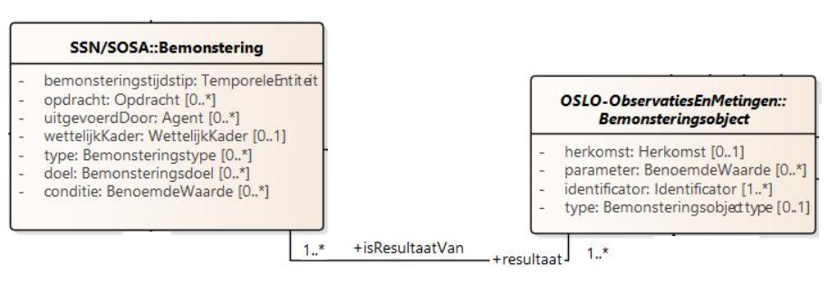
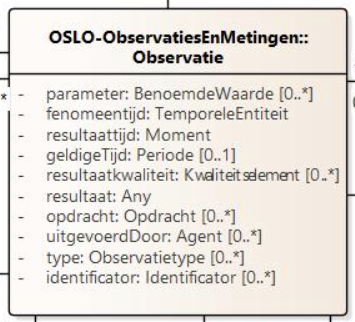
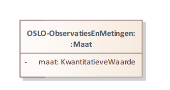

# Aanpak

## BoRuimtelijkBemonsteringsobject

Aangezien we zowel ligging, als diepte naast de effectieve geometrie (puntlocatie) willen beschrijven, starten we vanuit een  BoRuimtelijkBemonsteringsobject.



`BoRuimtelijkBemonsteringsobject` is een `bemonsteringsobject`, hierdoor kunnen we de unieke identificator POINT_ID en het type beschrijven:

```json

"@id": "_:bmo001",
"@type": "BoRuimtelijkBemonsteringsobject",
"Bemonsteringsobject.identificator": {
    "@type": "Identificator",
    "Identificator.identificator": {
        "@value": "47862690",
        "@type": "cl-idt:bemonsteringsobjectid"
    }
},
"Bemonsteringsobject.type": "composite sample",
```

## Diepte van bemonstering

De diepte van de bemonstering kan via `BoRuimtelijkBemonsteringsobject.diepte` beschreven worden:

```json
"BoRuimtelijkBemonsteringsobject.diepte": {
    "@type": "KwantitatieveWaarde",
    "KwantitatieveWaarde.standaardEenheid": {
        "@type": "qudt-schema:Unit",
        "@id": "qudt-unit:M"
    },
    "KwantitatieveWaarde.waarde": 0.2
}
```

## Tijdstip van bemonstering

Willen we het tijdstip van de effectieve bemonstering toevoegen, dan doen we dit via `Bemonstering.bemonsteringstijdstip`. Dit vertegenwoordigt het specifieke tijdstip waarop de bemonstering plaatsvond. `time:Instant`  definieert het type van het `bemonsteringstijdstip`. `time:Instant` geeft aan dat het tijdstip wordt uitgedrukt als een specifiek moment in tijd (en dus bijvoorbeeld geen periode). `time:inXSDDateTime` is een verdere specificatie van het tijdstip en geeft aan dat het tijdstip wordt uitgedrukt in een bepaald datum- en tijdformaat. De `@type` specificatie `xsd:dateTime` geeft aan dat het formaat van de datum en tijd overeenkomt met de standaard XML Schema definitie voor datums en tijden. 




```json
"Bemonsteringsobject.isResultaatVan": {
    "@type": "Bemonstering",
    "Bemonstering.bemonsteringstijdstip": {
        "@type": "time:Instant",
        "time:inXSDDateTime": {
            "@type": "xsd:dateTime",
            "@value": "2018-07-06"
        }
    }
}
```

## Locatie van bemonstering

Om de daadwerkelijke puntgeometrie te beschrijven van de locatie waar de bemonstering is uitgevoerd, wordt aan de hand van `RuimtelijkBemonsteringsobject.geometrie` omschreven.
`@type`:`Punt` specificeert het type geometrie van het object. In dit geval is het een 'Punt', wat betekent dat het object wordt weergegeven door een puntengeometrie in een ruimtelijke context. `Geometrie.gml` is een eigenschap van de 'RuimtelijkBemonsteringsobject.geometrie' die de daadwerkelijke gegevens van de geometrie bevat in GML (Geography Markup Language) formaat.

`@value`: `<gml:Point ...>`: Dit geeft de exacte GML-gegevens weer van de puntgeometrie. De waarde bevat GML-tags die een punt definiëren met coördinaten (16.13421178, 47.15023795) met als referentie systeem EPSG 4326, wat overeenkomt met WGS84.

`@type`: `geosparql:gmlliteral`: Dit duidt het type van de geometrische gegevens aan, hier specifiek aangegeven als 'geosparql:gmlliteral', wat verwijst naar een literaal formaat gebruikt in GeoSPARQL, een standaard voor het vertegenwoordigen van geografische informatie.

```json
{
"RuimtelijkBemonsteringsobject.geometrie": {
    "@type": "Punt",
    "Geometrie.gml": {
        "@value": "<gml:Point srsName=\"http:\\//www.opengis.net/def/crs/EPSG/0/4326\"><gml:coordinates>16.13421178,47.15023795</gml:coordinates><gml:Point>",
        "@type": "geosparql:gmlliteral"
    }
}
```

## Geassocieerde observaties

`Bemonsteringsobject.bemonsterdObject` veld definieert het object dat bemonsterd is.

`Bemonsteringsobject.geassocieerdeObservatie` toont den lijst van geassocieerde observaties die gerelateerd zijn aan het 'Bemonsteringsobject'. Elke observatie heeft een unieke identificatie (bijv. `:Crbn001`, `:pH_CaCl2_001`, `_:pH_H2O_001`). Deze verwijzen naar specifieke metingen of analyses die zijn uitgevoerd op het bemonsterde object.

```json
"Bemonsteringsobject.bemonsterdObject": "",
"Bemonsteringsobject.geassocieerdeObservatie": [
    "_:Crbn001",
    "_:pH_CaCl2_001",
    "_:pH_H2O_001"
]
}

```

## Observatie Organic Carbon Content

Nu kunnen we de observatie met betrekking tot het organisch koolstofgehalte (Organic Carbon Content), gaan beschrijven.
`@id`: `_:Crbn001`, `@type`: `Meting`:  geeft de unieke identificatie van de observatie (':Crbn001') en het type van de data aan ('Meting'). 

Aan de hand van `Observatie.identificator` is het mogelijk om een unieke id toe te voegen aan deze specifieke observatie, waarbij door middel van een codelijst (cl-idt:observatieid_Crbn001) kan omschreven worden op wat deze unieke identificator slaat.

Het resultaat van de observatie dient te gebeuren aan de hand van `Observatie.resultaat`. In het [OSLO model Sensoren-en-bemonstering](https://data.vlaanderen.be/doc/applicatieprofiel/sensoren-en-bemonstering/kandidaatstandaard/2022-04-28/html/overview.jpg) wordt aangegeven dat dit dient beschreven te worden als een `KwantitatieveWaarde`. 

Een `KwantitatieveWaarde` geeft de waarde aan via `KwantitatieveWaarde.waarde` (in dit geval 12.4) en de eenheid van de gemeten waarde via `KwantitatieveWaarde.standaardEenheid`.





```json
{
    "@id": "_:Crbn001",
    "@type": "Meting",
    "Observatie.identificator": {
        "@type": "Identificator",
        "Identificator.identificator": {
            "@value": "1",
            "@type": "cl-idt:observatieid_Crbn001"
        }
    },
    "Observatie.resultaat": {
        "@type": "Maat",
        "Maat.maat": {
            "@type": "KwantitatieveWaarde",
            "KwantitatieveWaarde.waarde": 12.4,
            "KwantitatieveWaarde.standaardEenheid": {
                "@type": "qudt-schema:Unit",
                "@id": "qudt-unit:GM-PER-KiloGM"
            }
        }
    },
    "Observatie.geobserveerdKenmerk": "http://inspire.ec.europa.eu/codelist/SoilDerivedObjectParameterNameValue/organicCarbonContent",
    "Observatie.gebruikteProcedure": {
        "@type": "Observatieprocedure",
        "Observatieprocedure.specificatie": "https://www.iso.org/standard/18782.html"
    }
}
```

## Observatie pH Value (CaCl2)

Op dezelfde manier wordt de andere observatie beschreven:

```json
{
    "@id": "_:pH_CaCl2_001",
    "@type": "Meting",
    "Observatie.identificator": {
        "@type": "Identificator",
        "Identificator.identificator": {
            "@value": "1",
            "@type": "cl-idt:observatieid_pH_CaCl2"
        }
    },
    "Observatie.resultaat": {
        "@type": "Maat",
        "Maat.maat": {
            "@type": "KwantitatieveWaarde",
            "KwantitatieveWaarde.waarde": 4.1,
            "KwantitatieveWaarde.standaardEenheid": {
                "@type": "qudt-schema:Unit",
                "@id": "qudt-unit:PH"
            }
        }
    },
    "Observatie.geobserveerdKenmerk": "http://inspire.ec.europa.eu/codelist/SoilDerivedObjectParameterNameValue/pHValue",
    "Observatie.gebruikteProcedure": {
        "@type": "Observatieprocedure",
        "Observatieprocedure.specificatie": "https://www.iso.org/standard/40879.html"
    }
}
```

## Observatie pH Value (H2O)

Op dezelfde manier wordt de andere observatie beschreven:

```json
{
    "@id": "_:pH_H2O_001",
    "@type": "Meting",
    "Observatie.identificator": {
        "@type": "Identificator",
        "Identificator.identificator": {
            "@value": "1",
            "@type": "cl-idt:observatieid_pH_H2O"
        }
    },
    "Observatie.resultaat": {
        "@type": "Maat",
        "Maat.maat": {
            "@type": "KwantitatieveWaarde",
            "KwantitatieveWaarde.waarde": 4.81,
            "KwantitatieveWaarde.standaardEenheid": {
                "@type": "qudt-schema:Unit",
                "@id": "qudt-unit:PH"
            }
        }
    },
    "Observatie.geobserveerdKenmerk": "http://inspire.ec.europa.eu/codelist/SoilDerivedObjectParameterNameValue/pHValue",
    "Observatie.gebruikteProcedure": {
        "@type": "Observatieprocedure",
        "Observatieprocedure.specificatie": "https://www.iso.org/standard/40879.html"
    }
}
```