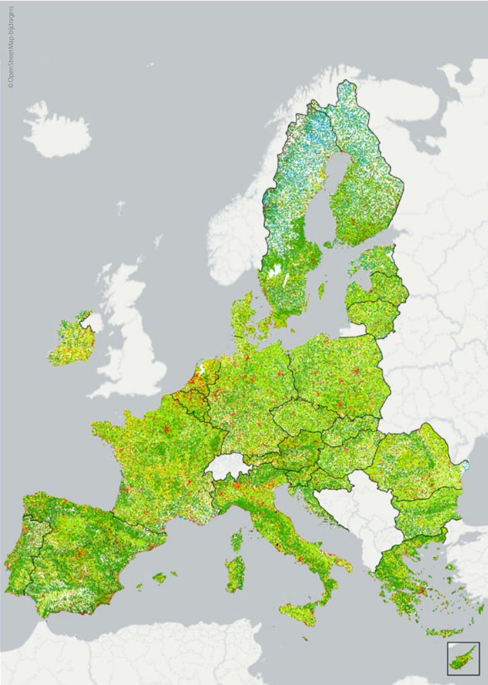

# LUCAS

De LUCAS-dataset, voluit Land Use and Coverage Area frame Survey, is een uitgebreid onderzoek geïnitieerd door EUROSTAT in samenwerking met het Directoraat-Generaal voor Landbouw en het JRC. Het doel van dit onderzoek is het verzamelen van gegevens over landgebruik en landbedekking in de lidstaten van de Europese Unie. De LUCAS-enquête wordt uitgevoerd door observaties op meer dan 250.000 punten in de EU, waardoor schattingen van landgebruik- en bedekkingstypes mogelijk zijn zonder het volledige gebied in kaart te brengen. Door de enquête elke paar jaar te herhalen, kunnen veranderingen in landgebruik worden vastgesteld.

In de uitbreiding van 2009/2012 werd de LUCAS-enquête uitgebreid met een bodemonderzoek in 23 EU-lidstaten. Dit bodemonderzoek was de eerste poging om een consistente ruimtelijke database van de bodembedekking in de EU te vormen, gebaseerd op gestandaardiseerde bemonsterings- en analytische procedures. Ongeveer 20.000 punten uit het hoofdraster van LUCAS werden geselecteerd voor het verzamelen van bodemmonsters, die in een centraal laboratorium werden geanalyseerd op verschillende fysische en chemische eigenschappen. Malta en Cyprus namen later deel aan de enquête, waarbij zij hun methodologieën aanpasten aan de LUCAS-normen. Bulgarije en Roemenië werden ook bemonsterd in 2012, maar de analyse van hun gegevens is nog gaande.

De uiteindelijke database bevat 19.967 georefereerde monsters uit 25 landen, met gedetailleerde informatie over bodemeigenschappen zoals deeltjesgrootte, pH, organisch koolstofgehalte en meer. Deze gegevens zijn openbaar toegankelijk na registratie. Het rapport "LUCAS Topsoil Survey: methodology, data and results" biedt diepgaande informatie over het ontwerp en de methodologie van de enquête.
