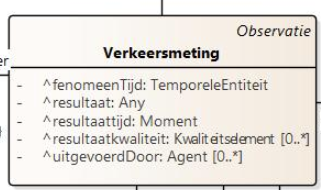

## Verkeersmeting

De dataset beschrijft het aantal fietsers dat is gedetecteerd door een verkeerssensor _:mti001, uitgevoerd op een verkeersmeetpunt _:mpt001, gedurende een bepaalde periode :\_fenomtime001. Het ´type´ veld geeft aan dat de sensor alleen fietsers meet, en het ´aantal´ veld geeft aan dat er geen fietsers zijn waargenomen.

```json
{
  "type": "FIETSERS",
  "aantal": 60
}
```

Aangezien er geen specifieke definities (a.d.h. van codelijsten) bestaan voor voertuitgtypes (bv. auto, fiets, enz.) en verkeerskenmerktype (bv. aantal, snelheid, enz.) dienen deze in codelijsten worden gedefinieerd.
Deze werden hier uitgewerkt:
[](https://data.vlaanderen.be/doc/conceptscheme/VkmVoertuigTypes/)
[](https://data.vlaanderen.be/doc/concept/VkmVerkeersKenmerkType/)

"Verkeerskenmerk.voertuigType": "cl-vrt:fiets" verwijst dus naar
[](https://data.vlaanderen.be/doc/concept/VkmVerkeersKenmerkType/fiets).

Via het OSLO model verkeersmetingen, is het mogelijk om volgende klassen te gaan definiëren:


Het teken '^' geeft aan, dat deze klassen zijn overgeërfd van een ander applciatieprofiel.

```json
{
  "@context": [
    "https://data.vlaanderen.be/doc/applicatieprofiel/verkeersmetingen/ontwerpstandaard/2023-03-14/context/Verkeersmetingen-ap.jsonld",
    {
      "cl-vrt": "https://data.vlaanderen.be/doc/concept/VkmVoertuigTypes/",
      "cl-vkt": "https://data.vlaanderen.be/doc/concept/VkmVerkeersKenmerkType/"
    }
  ],

  "@graph": [
    {
      "@id": "_:vrm001",
      "@type": "Verkeersmeting",
      "Verkeersmeting.geobserveerdKenmerk": {
        "@type": "Verkeerskenmerk",
        "Verkeerskenmerk.type": "cl-vkt:aantal",
        "Verkeerskenmerk.voertuigType": "cl-vrt:fiets"
      },
      "Verkeersmeting.resultaat": 60,
      "Verkeersmeting.uitgevoerdMet": "_:mti001",
      "Verkeersmeting.geobserveerdObject": "_:mpt001",
      "Verkeersmeting.fenomeenTijd": ":_fenomtime001"
    }
  ]
}
```

## Verkeersmeetpunt

De dataset beschrijft de locatie(lengte- en breedtegraad) van het meetpunt waar de sensor de verkeersmetingen uitvoert.

```json
{
  "site ID": "1",
  "site nr": "100046096",
  "long": 4.456121776137429,
  "lang": 50.91618331151478
}
```

```json
{
  "@id": "_:mpt001",
  "@type": "Verkeersmeetpunt",
  "Verkeersmeetpunt.geometrie": "_:g001",
},
{
    "@id": "_:g001",
    "@type": "Punt",
    "Geometrie.wkt": {
      "@value": "<http://www.opengis.net/def/crs/EPSG/0/4326> Point(50.91618331151478 4.456121776137429)",
      "@type": "geosparql:wktLiteral"
    }
  },

```

## Wegsegment en offset van het meetpunt

{: .note }
Om OpenLR compliant te zijn, dient bij een verkeersmeting zowel de locatie van het meetpunt (coördinaten), het wegsegment (a.d.v. begin en eindknoop, en eventuele shape knopen) en de offset van het meetpunt (de afstand van het beginknooppunt en het middelpunt) beschreven te zijn.

Aangezien enkel de locatie van het meetpunt wordt weergegeven, dient zowel de offset als het wegsegment berekend te worden. Dit gebeurd met een externe GIS functie tijdens de implementatie.


Als basiskaart kan gekozen worden om gebruik te maken van bijvoorbeeld openstreetmap of het wegenregister.

Een dergelijke functie werd hier reeds uitgewerkt in de vorm van een Python script:
[](https://github.com/samuvack/OSLO-OpenLR)

### Wegsegment

Volgens het OSLO model verkeersmetingen is de geometriemiddenlijn van het wegsegment verplicht om mee te geven.

Hieronder wordt weergegeven hoe deze polylijn wordt omschreven volgens een wktLiteral. Het is belangrijk dat het projectiesysteem
hier wordt aan meegegeven.

EPSG4326 slaat op de projectie WGS84 (latitude, longitude), EPSG 31370 slaat op de projectie Lambert72 (x,y).

```json
{
  "@id": "_:wgs001",
  "@type": "Wegsegment",
  "Wegsegment.beginknoop": "_:wgkn001",
  "Wegsegment.eindknoop": "_:wgkn002",
  "Wegsegment.geometriemiddenlijn": {
    "@type": "LineString",
    "Geometrie.wkt": {
      "@value": "<http://www.opengis.net/def/crs/EPSG/0/4326> LINESTRING (30 10, 10 30, 40 40)",
      "@type": "geosparql:wktLiteral"
    }
  }
}
```

## Offset

In het uitgewerkt voorbeeld hieronder wordt weergegeven hoe de afstand van het beginpunt tot het meetpunt wordt omschreven.
In dit fictief voorbeeld wordt een offset van 300m omschreven. Het is belangrijk dat hier de toepassingsRichting voor deze puntreferentie wordt
meegegeven (is verplicht in het OSLO model).

```json
{
      "@id": "_:pr001",
      "@type": "Puntreferentie",
      "Puntreferentie.opPositie": {
        "@type": "Lengte",
        "KwantitatieveWaarde.waarde": "300",
        "KwantitatieveWaarde.standaardEenheid": {
          "@value": "m",
          "@type": "ucum:ucumunit"
        }
      },
      "Linkreferentie.toepassingsRichting": "cl-trt:bothDirections"
    },
```

## Verkeersmeting.fenomeenTijd

De bron data geeft de tijdperiode met de velden `van` en `tot`:

```json
{
  "van": "2023-06-01 00:00:00.0",
  "tot": "2023-06-01 00:15:00.0"
}
```

De OSLO data mapping hiervan is de eigenschap `Verkeersmeting.fenomeenTijd`.

```json
"Verkeersmeting.fenomeenTijd": {
        "@type": "time:ProperInterval",
        "time:hasBeginning": {
          "@type": "time:Instant",
          "time:inXSDDateTime": {
            "@type": "xml-schema:dateTime",
            "@value": "20230601T00:00:00.000"
          }
        },
        "time:hasEnd": {
          "@type": "time:Instant",
          "time:inXSDDateTime": {
            "@type": "xml-schema:dateTime",
            "@value": "20230601T00:00:15.000"
          }
        }
      }
```
