# Hoppinpunten


## Id en naam

Eerst en vooral wordt een Hoppinpunt gedefinieerd:

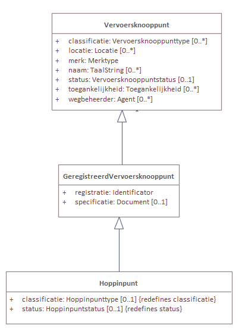

Een Hoppinpunt is een subklasse van GeregistreerdVervoersknooppunt, wat op zich ook een subklasse is van een Vervoersknooppunt.

```json
{
    "@id": "_:vkn001",
    "@type": "Hoppinpunt",
    "GeregistreerdVervoersknooppunt.registratie": {
        "@type": "Identificator",
        "Identificator.identificator": {
            "@value": "1",
            "@type": "cl-idt:hoppinpunt"
        }
    },
    "Vervoersknooppunt.naam": {
        "@value": "Station Aalst",
        "@language": "nl"
    }
}
```

## Locatie

Om de locatie van het Hoppinpunt te omschrijven, wordt dit mogelijk om gebruik te maken van "Vervoersknooppunt.locatie".

Het [OSLO model](https://data.vlaanderen.be/doc/applicatieprofiel/mobiliteit/vervoersknooppunten) geeft aan dat het mogelijk is om [polygonen](https://data.vlaanderen.be/doc/applicatieprofiel/mobiliteit/vervoersknooppunten/#Polygoon) te omschrijven:

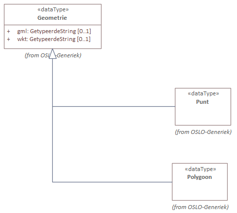

```json

"Vervoersknooppunt.locatie": [
    {
        "@type": "Plaats",
        "Plaats.plaatsnaam": {
            "@value": "Aalst",
            "@language": "nl"
        },
        "dcterms:type": "cl-plt:vervoersregio"
    },
    {
        "@type": "Plaats",
        "Plaats.plaatsnaam": {
            "@value": "Aalst",
            "@language": "nl"
        },
        "dcterms:type": "cl-plt:gemeente"
    },
    {
        "@type": "Polygon",
        "Geometrie.gml": {
            "@value": "<gml:Polygon srsName=\"http:\\//www.opengis.net/def/crs/EPSG/0/31370\"><gml:coordinates>126966 181444,126958.387953251 181405.731656763,126936.710678119 181373.289321881,126904.268343237 181351.612046749,126866 181344,126827.731656763 181351.612046749,126795.289321881 181373.289321881,126773.612046749 181405.731656763,126766 181444,126773.612046749 181482.268343236,126795.289321881 181514.710678119,126827.731656763 181536.387953251,126866 181544,126904.268343237 181536.387953251,126936.710678119 181514.710678119,126958.387953251 181482.268343236,126966 181444</gml:coordinates><gml:Polygon>",
            "@type": "geosparql:gmlliteral"
        }
    }
]
```

## Wegbeheerder

Informatie rond de wegbeheerder kunnen worden beschreven worden (zoals classificatie).

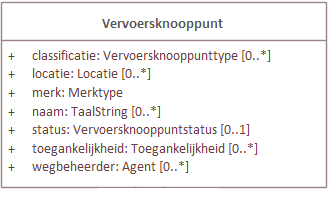

Om een organisatie toe te wijzen als wegbeheerder, kan dit gebruikmakend van het OSLO model [organisatie-basis](https://data.vlaanderen.be/doc/applicatieprofiel/organisatie-basis/).

```json
"Vervoersknooppunt.classificatie": "cl-hcl:interregionaal",
"Vervoersknooppunt.status": [
    "cl-hst:goedgekeurd"
],
"Vervoersknooppunt.wegbeheerder": {
    "@type": "Organisatie",
    "voorkeursnaam": {
        "@value": "Aalst",
        "@language": "nl"
    }
}
```

## Transportobject

Het treinstation als [transportknoop](https://data.vlaanderen.be/doc/applicatieprofiel/mobiliteit/vervoersknooppunten/#Transportknoop) wordt mogelijk ook te omschrijven via het Hoppin OSLO model:

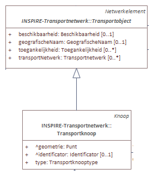

```json
    "Vervoersknooppunt.transportobject": {
        "@type": "Transportknoop",
        "Transportknoop.type": "cl-tkt:treinstation",
        "Transportknoop.geometrie": "<gml:Point srsName=\"http:\\//www.opengis.net/def/crs/EPSG/0/31370\"><gml:coordinates>0 0</gml:coordinates><gml:Point>",
        "NetwerkElement.netwerk": [
            {
                "@type": "Transportnetwerk",
                "Transportnetwerk.geografischeNaam": {
                    "@value": "KernNet",
                    "@language": "nl"
                }
            },
            {
                "@type": "Transportnetwerk",
                "Transportnetwerk.geografischeNaam": {
                    "@value": "AanvullendNet",
                    "@language": "nl"
                }
            },
            {
                "@type": "Transportnetwerk",
                "Transportnetwerk.geografischeNaam": {
                    "@value": "FunctioneelNet",
                    "@language": "nl"
                }
            }
        ]
    }
```


## Dienstverlening

Via de klasse [AanvullendeDienst](https://data.vlaanderen.be/doc/applicatieprofiel/mobiliteit/vervoersknooppunten/#AanvullendeDienst) wordt het mogelijk om bijvoorbeeld een krantenwinkel, postdienst of restaurant in een station. De Diensten die daarmee worden aangevuld of ondersteund zijn bv Mobiliteitsdiensten.

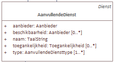

```json
"Vervoersknooppunt.dienst": [
    "_:av001"
]

...

{
    "@id": "_:av001",
    "@type": "AanvullendeDienst",
    "AanvullendeDienst.aanbieder": "_:aan099",
    "AanvullendeDienst.naam": {
        "@value": "Zitbanken wachtzaal",
        "@language": "nl"
    },
    "AanvullendeDienst.type": "cl-avd:wachtacommodatie",
    "AanvullendeDienst.beschikbaarOpInfrastructuurelement": [
        {
            "@type": "Zitbank"
        }
    ],
    "rdfs:value": 10
}
```


## Infrastructuurelement

```json

    "Vervoersknooppunt.infrastructuurelement": [
        "_:laderEV001",
        "_:fietsstalling001",
        "_:hoppinzuil010"
    ]
```

### Lader

Laadpalen kunnen worden beschreven via de klasse [lader](https://data.vlaanderen.be/doc/applicatieprofiel/mobiliteit/vervoersknooppunten/#Lader):

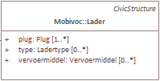

```json
{
    "@id": "_:laderEV001",
    "@type": "Lader",
    "Lader.type": "snellader",
    "Lader.vervoermiddel": "cl-vm:auto",
    "rdfs:value": 1
}
```


### Fietsstalling

De OSLO klasse [fietsstalling](https://data.vlaanderen.be/doc/applicatieprofiel/mobiliteit/vervoersknooppunten/#Fietsstalling) is een subklasse van Parkeerfaciliteit. Deze klassen laten het toe om openingsuren, eigenschappen zoals overdekt/afsluitbaar al dan niet, aanwezigheid van fietsdeelfaciliteiten, kenmerk, e.d. te omschrijven:

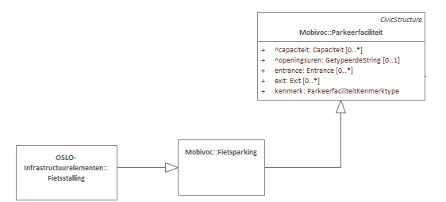

```json
{
    "@id": "_:fietsstalling001",
    "@type": "Fietsstalling",
    "Parkeerfaciliteit.capaciteit": {
        "@type": "Capaciteit",
        "Capaciteit.maximum": 5,
        "Capaciteit.totaal": 20,
        "Capaciteit.voertuigtype": {
            "@value": "fiets",
            "@type": "cl-vrtgtype:fiets"
        }
    },
    "Parkeerfaciliteit.openingsuren": {
        "@type": "Periode",
        "Periode.begin": {
            "@type": "time:Instant",
            "time:inXSDDateTime": {
                "@type": "xsd:dateTime",
                "@value": "2018-07-06"
            }
        },
        "Periode.einde": {
            "@type": "time:Instant",
            "time:inXSDDateTime": {
                "@type": "xsd:dateTime",
                "@value": "2018-07-06"
            }
        }
    },
    "Fietsstalling.overdekt": "True",
    "Fietsstalling.afsluitbaar": "True",
    "Fietsstalling.fietsdelen": "False",
    "Parkeerfaciliteit.kenmerk": [
        "cl-pfk:buitenmaatse_fietsen"
    ]
}
```

### Hoppinzuil

Het OSLO model omschrijft hoe een [Hoppinzuil](https://data.vlaanderen.be/doc/applicatieprofiel/mobiliteit/vervoersknooppunten/#Hoppinzuil) kan omschreven worden:

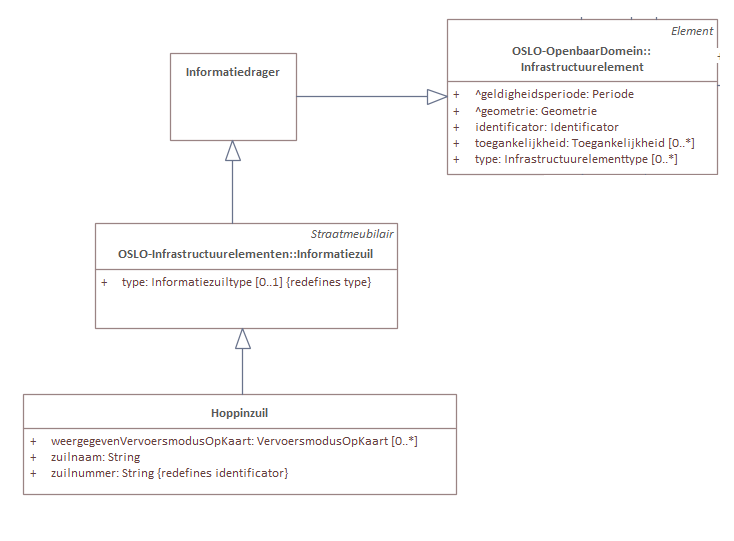

Basisinformatie zoals zuilnaam als zuilnummer zitten reeds vervat onder de klasse Hoppinzuil. Om de locatie te omschrijven van dit Hoppinzuil, kan dit via "Infrastructuurelement". "Hoppinzuil" is namelijk een subklasse van "Infrastructuurelement".

```json

{
    "@id": "_:hoppinzuil010",
    "@type": "Hoppinzuil",
    "Hoppinzuil.zuilnaam": "Hoppinzuil Aalst",
    "Hoppinzuil.zuilnummer": "10",
    "Infrastructuurelement.geometrie": {
        "@type": "Punt",
        "Geometrie.gml": {
            "@value": "<gml:Point srsName=\"http:\\//www.opengis.net/def/crs/EPSG/0/31370\"><gml:coordinates>156579.64 216540.27</gml:coordinates><gml:Point>",
            "@type": "geosparql:gmlliteral"
        }
    }
}
```


## Toegankelijkheid Hoppinpunt

De [toegankelijkheid](https://data.vlaanderen.be/doc/applicatieprofiel/mobiliteit/vervoersknooppunten/#Toegankelijkheid) beschrijven van een Hoppinpunt, kan via de klasse "Vervoersknooppunt" wat de eigenschap "toegankelijkheid" bevat.

Het OSLO model maakt het mogelijk om zowel niveau, onderdeel als type te omschrijven:

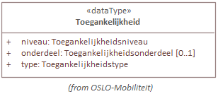

```json
"Vervoersknooppunt.toegankelijkheid": [
    {
        "@type": "Toegankelijkheid",
        "Toegankelijkheid.niveau": "cl-tni:zelfstandigToegankelijk",
        "Toegankelijkheid.onderdeel": "cl-ton:lift",
        "Toegankelijkheid.type": "cl-tty:motorischeBeperking"
    },
    {
        "@type": "Toegankelijkheid"
    }
]
```


## Mobiliteitsdienstverlening

De klasse [Mobilteitsdienst](https://data.vlaanderen.be/doc/applicatieprofiel/mobiliteit/vervoersknooppunten/#Mobiliteitsdienst) maakt het mogelijk om het type (bijvoorbeeld een deelwagen) en zijn aanbieder te beschrijven:

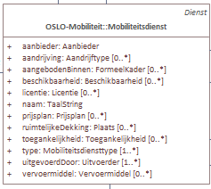


```json

{
    "@id": "_:dienst001",
    "@type": "Mobiliteitsdienst",
    "Mobiliteitsdienst.naam": {
        "@value": "Deelwagen",
        "@language": "nl"
    },
    "Mobiliteitsdienst.type": "cl-mdt:deelwagen",
    "Mobiliteitsdienst.aanbieder": "_:organisatie001",
    "Mobiliteitsdienst.uitgevoerdMet": "_:organisatie001"
}
```

### Aanbieder deelwagen

Wanneer de aanbieder van een Mobiliteitsdienst een organisatie is, kan dit best beschreven worden gebruik makend van het OSLO model [organisatie-basis](https://data.vlaanderen.be/doc/applicatieprofiel/organisatie-basis/):

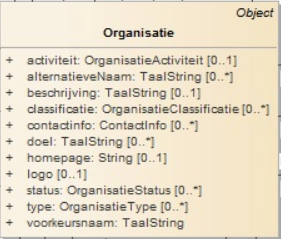

```json
{
    "@id": "_:organisatie001",
    "@type": [
        "GeregistreerdeOrganisatie",
        "Aanbieder",
        "Uitvoerder"
    ],
    "Organisatie.contactinfo": {
        "@type": "Contactinfo",
        "Contactinfo.adres": {
            "@type": "Adresvoorstelling",
            "gemeentenaam": {
                "@value": "Gent",
                "@language": "nl"
            },
            "straatnaam": {
                "@value": "Koningin Maria Hendrikaplein",
                "@language": "nl"
            },
            "huisnummer": "65",
            "busnummer": "b",
            "postcode": "9000"
        },
        "Contactinfo.telefoon": "093884565"
    },
    "homepage": "www.cambio.be",
    "logo": "https://cambio.png",
    "registratie": {
        "@type": "Identificator",
        "Identificator.identificator": {
            "@value": "0479.561.664",
            "@type": "cl-idt:kbonummer"
        }
    },
    "voorkeursnaam": {
        "@value": "Cambio Vlaanderen",
        "@language": "nl"
    }
}
```
