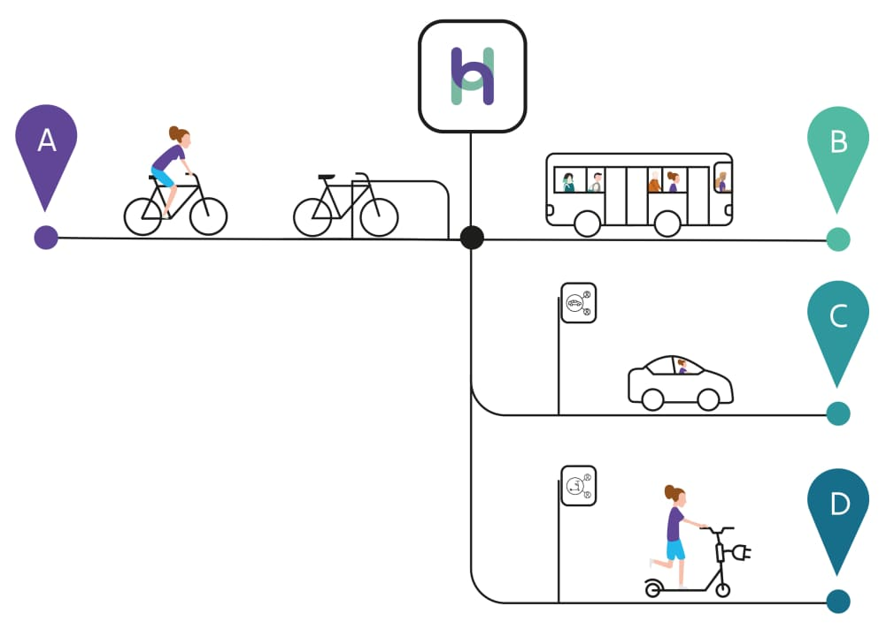

# Hoppinpunten

Hoppin is de benaming waaronder de Vlaamse overheid Vervoersknooppunten voor reizigersvervoer aanduidt die voldoen aan vastgelegde (kwaliteits)eisen. Zaken van belang zijn herkenbaarheid (toepassing Hoppin huisstijl), toegankelijkheid (voor alle gebruikers ongeacht hun beperking, leeftijd etc), minimale uitrusting (bvb fietsstallingen, informatiedragers... ), afstemming op mobiliteitsplannen etc.

