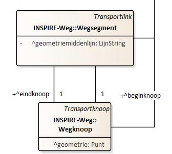
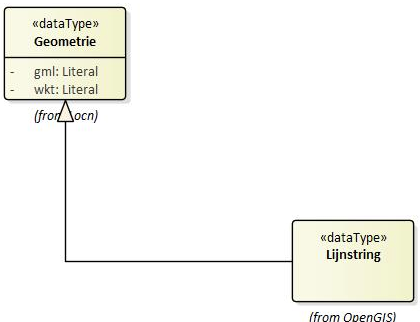

# Stap voor stap

## Wegsegment

Het is mogelijk om het wegsegment te beschrijven volgens `Wegsegment.geometriemiddenlijn` uit het implementatiemodel.



Het OSLO model geeft aan dat het moet gaan over een lijnstring (het is dus niet mogelijk om hier een puntgeometrie of polygoongeometrie te gaan definieren). Een lijnstring wordt beschreven via Geometrie:



`Geometrie.gml` geeft de geometrie weer van het wegsegment in GML (Geography Markup Language), een XML-gebaseerde taal voor het uitdrukken van geografische kenmerken. Deze regel bevat de GML-representatie van de geometrie van het wegsegment. Het geeft een reeks punten weer, met elk punt weergegeven als een coördinatenpaar. Aan het coördinatiestelsel zien we dat het gaat over EPSG 4326, wat WGS84 stelsel is. De coördinaten zijn dus weergegeven in latitude, longitude.

`@type`: `geosparql:gmlLiteral`: Dit specificeert dat de waarde een GML-literal is, een formaat dat wordt gebruikt in geografische SPARQL-query's.

```json
{
  "@id": "_:wgs001",
  "@type": "Wegsegment",
  "Wegsegment.geometriemiddenlijn": {
    "Geometrie.gml": {
      "@value": "<gml:Lijnstring srsName=\"http:\\//www.opengis.net/def/crs/EPSG/0/4326\"><gml:coordinates>50.9346197016993 4.04451041920408,50.9346499094883 4.04468516398887,50.9346736897766 4.04476128017613, 50.9347048165154 4.04486091154096,50.9347897018035 4.0450104190652,50.9348297017355 4.04508041942127,50.9349798325647 4.04536795581668,50.9350979049717 4.04561050090522, 50.9351073291995 4.04563353497237,50.9351797011571 4.04581042002322</gml:coordinates><gml:Point>",
      "@type": "geosparql:gmlLiteral"
    }
  },
  "Wegsegment.beginknoop": "_:wgkn001",
  "Wegsegment.eindknoop": "_:wgkn002"
}
```

## Wegknoop

```json
{
  "@id": "_:wgkn001",
  "@type": "Wegknoop",
  "Wegknoop.geometrie": {
    "@type": "Punt",
    "Geometrie.gml": {
      "@value": "<gml:Point srsName=\"http:\\//www.opengis.net/def/crs/EPSG/0/4326\"><gml:coordinates>50.9346197016993 4.0445104192040</gml:coordinates><gml:Point>",
      "@type": "geosparql:gmlLiteral"
    }
  }
}
```

## Verkeerstelling

Het aantal voertuigen (auto's of zwaar verkeer), kunnen aan de hand van `Verkeerstelling` beschreven worden. Hierbij is het noodzakelijk om eerst te specifiëren dat het gaat over `Verkeerstellingkenmerk.kenmerktype` van het type `aantal` (dit wordt aan de hand van een codelijst beschreven). Om aan te geven dat het gaat over het voertuigtye `auto` wordt ook dit beschreven via een codelijst.


```json
    {
      "@id": "_:vkmfiets001",
      "@type": "Verkeerstelling",
      "Verkeerstelling.geobserveerdKenmerk": {
        "@type": "Verkeerstellingkenmerk",
        "Verkeerstellingkenmerk.kenmerktype": "cl-vkt:aantal",
        "Verkeerskenmerk.voertuigType": "cl-vrt:fiets"
      },
      "Verkeersmeting.geobserveerdObject": "_:mpt001",
      "Verkeersmeting.fenomeenTijd": ":_fenomtime001",
      "Verkeerstelling.tellingresultaat": 33.3209922251018,
      "Verkeersmeting.uitgevoerdMet": "_:mti001",
      "dct:memberOf": "_:dataset001"
    }
```

## Verkerssnelheidsmeting

Anders dan bij verkeerstelling, vermeld bij een verkeerssnelheidsmeting `Verkeerssnelheidsmetingkenmerk.kenmerktype` het type gemeten snelheid (bijvoorbeeld v85) aan de hand van een codelijst (bijvoorbeeld cl-vkt). Het resultaat van de verkeerssnelheidsmeting dient via `Verkeerssnelheidsmeting.resultaat` te gebeuren aan de hand van `KwantitatieveWaarde`. Deze `KwantitatieveWaarde` vermeld naast de `KwantitatieveWaarde.waarde`, ook de eenheid via `KwantitatieveWaarde.standaardEenheid` (in dit geval km/h via `qudt-unit:KiloM-PER-HR`). 


```json
  {
    "@id": "_:vmtauto002",
    "@type": "Verkeerssnelheidsmeting",
    "Verkeerssnelheidsmeting.geobserveerdKenmerk": {
      "@type": "Verkeerssnelheidsmetingkenmerk",
      "Verkeerssnelheidsmetingkenmerk.kenmerktype": "cl-vkt:v85",
      "Verkeerskenmerk.voertuigType": "cl-vrt:auto"
    },
    "Verkeersmeting.geobserveerdObject": "_:mpt001",
    "Verkeersmeting.fenomeenTijd": ":_fenomtime001",
      "Verkeerssnelheidsmeting.resultaat": {
        "@type": "KwantitatieveWaarde",
        "KwantitatieveWaarde.waarde": 30,
        "KwantitatieveWaarde.standaardEenheid": {
          "@id": "qudt-unit:KiloM-PER-HR",
          "@type": "qudt-schema:unit"
        }},
    "Verkeersmeting.uitgevoerdMet": "_:mti001"
  }
```


## Verkeersmeetpunt

{: .note }
Door privacy redenen wordt een virtueel verkeersmeetpunt berekend, gelegen in het midden van het wegsegement.

We zouden de metingen rechtstreeks kunnen koppelen aan de Wegsegment waarop ze slaan (geobserveerdObject is Wegsegment x), maar we kiezen er hier voor om het Verkeersmeetpunt als geobserveerdObject op te geven, dat dit Wegsgement bemonstert.

{: .note }
Deze werkwijze benadert meer de OpenLR-aanpak waarmee we compatibel willen zijn.

Om de twee inline Verkeersmeetpunten te situeren langs het Wegsegment maken we een Puntreferentie aan, ttz we geven aan waar het punt ligt door de afstand op te geven (offset in OpenLR) tov het begin vd geometrie van het Wegsegment. 


{: .note }
Alternatief zou zijn om de ligging van beide meetpunten gewoon dmv de coördinaten van het omvattend meetpunt te beschrijven, deze coördinaten staan ook in de aangeleverde data.

Hier wordt Toepassingsrichting "bothDirections" omdat de meetpunten beide wegkanten monitoren (telslang over de ganse weg). Alternatief zou twee aparte netwerkreferenties omvatten,
een per richting.

```json
{
  "@id": "_:mpt001",
  "@type": "Verkeersmeetpunt",
  "Verkeersmeetpunt.geometrie": {
    "@type": "Punt",
    "Geometrie.gml": {
      "@value": "<gml:Point srsName=\"http:\\//www.opengis.net/def/crs/EPSG/0/4326\"><gml:coordinates>virtual_x,virtual_y</gml:coordinates><gml:Point>",
      "@type": "geosparql:gmlLiteral"
    }
  },
  "Verkeersmeetpunt.netwerkreferentie": {
    "@type": "Puntreferentie",
    "Puntreferentie.opPositie": {
      "@type": "Lengte",
      "KwantitatieveWaarde.waarde": "300",
      "KwantitatieveWaarde.standaardEenheid": {
        "@value": "m",
        "@type": "ucum:ucumunit"
      }
    }
  },
  "Verkeersbemonsteringsobject.bemonsterdObject": "_:wgs001"
}
```

## fenomeenTijd

Willen we het tijdstip van de effectieve verkeersmeting toevoegen, dan doen we dit via "Verkeersmeting.fenomeenTijd". Dit vertegenwoordigt het specifieke tijdstip waarop de Verkeersmeting plaatsvond. `time:TemporalEntity` definieert het type van de `Verkeersmeting`. `time:Instant` geeft aan dat het tijdstip wordt uitgedrukt als een specifiek moment in tijd (en dus bijvoorbeeld geen periode). `time:inXSDDateTime` is een verdere specificatie van het tijdstip en geeft aan dat het tijdstip wordt uitgedrukt in een bepaald datum- en tijdformaat. De `@type` specificatie `xsd:dateTime` geeft aan dat het formaat van de datum en tijd overeenkomt met de standaard XML Schema definitie voor datums en tijden. 

```json
{
  "@id": "_:fenomtime001",
  "Verkeersmeting.fenomeenTijd": {
    "@type": "time:ProperInterval",
    "time:hasBeginning": {
      "@type": "time:Instant",
      "time:inXSDDateTime": {
        "@type": "xml-schema:dateTime",
        "@value": "20210930T06:00:00.000"
      }
    },
    "time:hasEnd": {
      "@type": "time:Instant",
      "time:inXSDDateTime": {
        "@type": "xml-schema:dateTime",
        "@value": "20210930T07:00:00.000"
      }
    }
  }
}
```

## Sensor

```json
{
  "@id": "_:mti001",
  "@type": "Sensor",
  "Systeem.type": "cl-mit:telraam",
  "Sensor.implementeert": {
    "@type": "Observatieproceduretype",
    "Observatieprocedure.type": "cl-op:type"
  }
}
```
