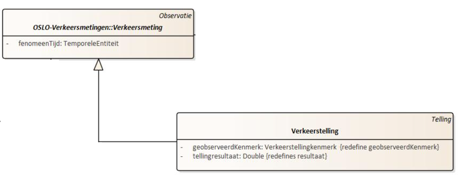
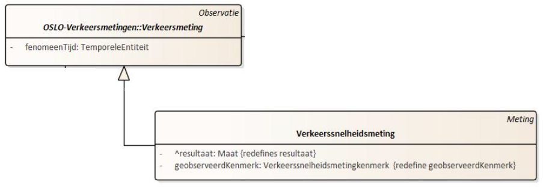

# Stap voor stap


## Verkeerstelling

Het aantal voertuigen (auto's of zwaar verkeer), kunnen aan de hand van `Verkeerstelling` beschreven worden. Hierbij is het noodzakelijk om eerst te specifiëren dat het gaat over `Verkeerstellingkenmerk.kenmerktype` van het type `aantal` (dit wordt aan de hand van een codelijst beschreven). Om aan te geven dat het gaat over het voertuigtye `auto` wordt ook dit beschreven via een codelijst.



```json

    {
      "@id": "_:vkmauto001",
      "@type": "Verkeerstelling",
      "Verkeerstelling.geobserveerdKenmerk": {
        "@type": "Verkeerstellingkenmerk",
        "Verkeerstellingkenmerk.kenmerktype": "cl-vkt:aantal",
        "Verkeerskenmerk.voertuigType": "cl-vrt:auto"
      },
      "Verkeersmeting.geobserveerdObject": "_:mpt001",
      "Verkeersmeting.fenomeenTijd": "_:fenomtime001",
      "Verkeerstelling.verkeerstellingTellingresultaat": 8,
      "Verkeersmeting.uitgevoerdMet": {
            "@type": "Sensor",
            "Systeem.type": "cl-mit:pneumatisch"
      },
      "dct:memberOf": "_:dataset001"
    }
```

## Verkeerssnelheidsmeting

Anders dan bij verkeerstelling, vermeld bij een verkeerssnelheidsmeting `Verkeerssnelheidsmetingkenmerk.kenmerktype` het type gemeten snelheid (bijvoorbeeld v85) aan de hand van een codelijst (bijvoorbeeld cl-vkt). Het resultaat van de verkeerssnelheidsmeting dient via `Verkeerssnelheidsmeting.resultaat` te gebeuren aan de hand van `KwantitatieveWaarde`. Deze `KwantitatieveWaarde` vermeld naast de `KwantitatieveWaarde.waarde`, ook de eenheid via `KwantitatieveWaarde.standaardEenheid` (in dit geval km/h via `qudt-unit:KiloM-PER-HR`). 



```json
{
"@id": "_:vmtauto002",
"@type": "Verkeerssnelheidsmeting",
...
"Verkeerssnelheidsmeting.geobserveerdKenmerk": {
    "@type": "Verkeerssnelheidsmetingkenmerk",
    "Verkeerssnelheidsmetingkenmerk.kenmerktype": "cl-vkt:v85",
    "Verkeerskenmerk.voertuigType": "cl-vrt:auto"
},
"Verkeerssnelheidsmeting.resultaat": {
    "@type": "KwantitatieveWaarde",
    "KwantitatieveWaarde.waarde": 82,
    "KwantitatieveWaarde.standaardEenheid": {
    "@id": "qudt-unit:KiloM-PER-HR",
    "@type": "qudt-schema:unit"
    }
}
}
```

## Wegsegment


Het is mogelijk om het wegsegment te beschrijven volgens `Wegsegment.geometriemiddenlijn` uit het implementatiemodel.


Het OSLO model geeft aan dat het moet gaan over een lijnstring (het is dus niet mogelijk om hier een puntgeometrie of polygoongeometrie te gaan definieren). Een lijnstring wordt beschreven via Geometrie:


`Geometrie.gml` geeft de geometrie weer van het wegsegment in GML (Geography Markup Language), een XML-gebaseerde taal voor het uitdrukken van geografische kenmerken. Deze regel bevat de GML-representatie van de geometrie van het wegsegment. Het geeft een reeks punten weer, met elk punt weergegeven als een coördinatenpaar. Aan het coördinatiestelsel zien we dat het gaat over EPSG 3812, wat Lambert 2008 stelsel is. De coördinaten zijn dus weergegeven in X,Y.

Lambert2008 als nieuw projectiesysteem brengt twee belangrijke voordelen met zich mee:

* De ETRS89 datum wordt ook gebruikt in Europa om locatiemetingen komende van het Global Navigation Satellite System (GNSS) in uit te drukken. GNSS data kunnen dus rechtstreeks geprojecteerd worden in Lambert2008 zonder bijkomende transformaties.
* ETRS89 is de referentiedatum voor alle geografische gegevens in Europa. Data geprojecteerd in Lambert2008 is hierdoor conform Europese regelgeving rond geodata infrastructuur (zie de INSPIRE-richtlijn).


`@type`: `geosparql:gmlLiteral`: Dit specificeert dat de waarde een GML-literal is, een formaat dat wordt gebruikt in geografische SPARQL-query's.

```json
{
      "@id": "_:wgs001",
      "@type": "Wegsegment",
      "Wegsegment.geometriemiddenlijn": {
        "Geometrie.gml": {
          "@value": "<gml:Linestring srsName=\"http:\\//www.opengis.net/def/crs/EPSG/0/31370\"><gml:coordinates>85255.6517999992 196641.521899998, 85217.3483000025 196719.535100002, 85207.9952000007 196729.535599999</gml:coordinates><gml:Point>",
          "@type": "geosparql:gmlLiteral"
        }
      },
      "Wegsegment.beginknoop": "_:wgkn001",
      "Wegsegment.eindknoop": "_:wgkn002"
}
```

## Wegknoop

Om de daadwerkelijke puntgeometrie te beschrijven het begin-of eindknoop van een wegsegment, wordt aan de hand van `Wegknoop.geometrie` beschreven.

`@type`:`Punt` specificeert het type geometrie van het object. In dit geval is het een 'Punt', wat betekent dat het object wordt weergegeven door een puntengeometrie in een ruimtelijke context. `Geometrie.gml` is een eigenschap van de 'Wegknoop.geometrie' die de daadwerkelijke gegevens van de geometrie bevat in GML (Geography Markup Language) formaat.

`@value`: `<gml:Point ...>` geeft de exacte GML-gegevens weer van de puntgeometrie. De waarde bevat GML-tags die een punt definiëren met coördinaten (50.9346197016993 4.0445104192040) met als referentie systeem EPSG 3812, wat overeenkomt met Lambert 2008.

`@type`: `geosparql:gmlliteral`: Dit duidt het type van de geometrische gegevens aan, hier specifiek aangegeven als 'geosparql:gmlliteral', wat verwijst naar een literaal formaat gebruikt in GeoSPARQL, een standaard voor het vertegenwoordigen van geografische informatie.

```json
{
      "@id": "_:wgkn001",
      "@type": "Wegknoop",
      "Wegknoop.geometrie": {
        "@type": "Punt",
        "Geometrie.gml": {
          "@value": "<gml:Point srsName=\"http:\\//www.opengis.net/def/crs/EPSG/0/3812\"><gml:coordinates>85255.6517999992 196641.521899998</gml:coordinates><gml:Point>",
          "@type": "geosparql:gmlLiteral"
        }
      }
    }
```

## Verkeersmeetpunt

We zouden de metingen rechtstreeks kunnen koppelen aan de Wegsegment waarop ze slaan (geobserveerdObject is Wegsegment x), maar we kiezen er hier voor om het Verkeersmeetpunt als geobserveerdObject op te geven, dat dit Wegsgement bemonstert.

{: .note }
Deze werkwijze benadert meer de OpenLR-aanpak waarmee we compatibel willen zijn.

Om de twee inline Verkeersmeetpunten te situeren langs het Wegsegment maken we een Puntreferentie aan, ttz we geven aan waar het punt ligt door de afstand op te geven (offset in OpenLR) tov het begin vd geometrie van het Wegsegment. In dit geval is de offset ten opzichte van het beginknooppunt dus 101.904619949324m.

{: .note }
Alternatief zou zijn om de ligging van beide meetpunten gewoon dmv de coördinaten van het omvattend meetpunt te beschrijven, deze coördinaten staan ook in de aangeleverde data.

Hier wordt Toepassingsrichting "bothDirections" omdat de meetpunten beide wegkanten monitoren (telslang over de ganse weg). Alternatief zou twee aparte netwerkreferenties omvatten,
een per richting.

```json
{
    "@id": "_:mpt001",
    "@type": "Verkeersmeetpunt",
    "Verkeersmeetpunt.geometrie": {
    "@type": "Punt",
    "Geometrie.gml": {
        "@value": "<gml:Point srsName=\"http:\\//www.opengis.net/def/crs/EPSG/0/3812\"><gml:coordinates>85217.3483000025 196719.535100002</gml:coordinates><gml:Point>",
        "@type": "geosparql:gmlLiteral"
    }
    },
    "Verkeersmeetpunt.netwerkreferentie": {
    "@type": "Puntreferentie",
    "Puntreferentie.opPositie": {
        "@type": "Lengte",
        "KwantitatieveWaarde.waarde": "101.904619949324",
        "KwantitatieveWaarde.standaardEenheid": {
        "@value": "m",
        "@type": "ucum:ucumunit"
        }
    }
    },
    "Verkeersbemonsteringsobject.bemonsterdObject": "_:wgs001"
}
```

## Tijdstip meting 


Willen we het tijdstip van de effectieve verkeersmeting toevoegen, dan doen we dit via "Verkeersmeting.fenomeenTijd". Dit vertegenwoordigt het specifieke tijdstip waarop de Verkeersmeting plaatsvond. `time:TemporalEntity` definieert het type van de `Verkeersmeting`. `time:Instant` geeft aan dat het tijdstip wordt uitgedrukt als een specifiek moment in tijd (en dus bijvoorbeeld geen periode). `time:inXSDDateTime` is een verdere specificatie van het tijdstip en geeft aan dat het tijdstip wordt uitgedrukt in een bepaald datum- en tijdformaat. De `@type` specificatie `xsd:dateTime` geeft aan dat het formaat van de datum en tijd overeenkomt met de standaard XML Schema definitie voor datums en tijden. 

```json
{
    "@id": "_:fenomtime001",
    "Verkeersmeting.fenomeenTijd": {
    "@type": "time:TemporalEntity",
    "time:hasBeginning": {
        "@type": "time:Instant",
        "time:inXSDDateTime": {
        "@type": "xml-schema:dateTime",
        "@value": "20230907T00:00:00.000"
        }
    },
    "time:hasEnd": {
        "@type": "time:Instant",
        "time:inXSDDateTime": {
        "@type": "xml-schema:dateTime",
        "@value": "20230907T00:15:00.000"
        }
    }
    }
}
```