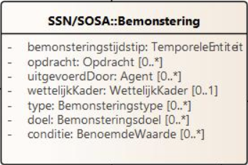
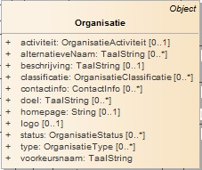
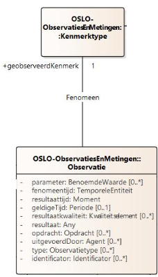

# Context

De @context sleutel definieert de context waarin de termen in het document worden geïnterpreteerd. Hier worden zowel naar externe contexten (URL's) als codelijsten verwezen.

Externe contexten: De eerste twee URL's verwijzen naar applicatieprofielen die specifieke termen en definities bevatten voor sensoren, bemonstering, observaties en metingen.

```
"https://data.vlaanderen.be/doc/applicatieprofiel/sensoren-en-bemonstering/kandidaatstandaard/2022-04-28/context/ap-sensoren-en-bemonstering.jsonld",
"https://data.vlaanderen.be/doc/applicatieprofiel/observaties-en-metingen/kandidaatstandaard/2022-04-28/context/ap-observaties-en-metingen.jsonld"

```

Codelijsten: Dit is een lijst van prefixen die worden gebruikt om termen in het document korter en leesbaarder te maken. Bijvoorbeeld, time verwijst naar het W3C Time Ontology, en qudt-schema verwijst naar het QUDT schema voor eenheden en dimensies.

```
"time": "http://www.w3.org/2006/time#",
"qudt-schema": "https://qudt.org/schema/qudt/",
"xml-schema": "http://www.w3.org/2001/XMLSchema#",
"geosparql": "http://www.opengis.net/ont/geosparql#",
"cl-bpt": "https://example.com/concept/bemonsteringsproceduretype/",
"cl-bet": "https://example.com/concept/bemonsteraartype/",
"cl-bco": "https://example.com/concept/bemonsteringsconditietype/",
"cl-ovt": "https://example.com/concept/observatieverzamelingtype/",
"cl-obt": "https://example.com/concept/observatietype/",
"cl-wrt": "https://example.com/concept/weertype/",
"cl-idt": "https://example.com/concept/identificatortype/",
"cl-mat": "https://example.com/concept/materiaaltype/",
"cl-mot": "https://example.com/concept/monstertype/",
"cl-fch": "https://data.omgeving.vlaanderen.be/id/concept/fysico-chemisch/",
"qudt-unit": "https://qudt.org/vocab/unit/"
```

# Graph

De @graph sleutel bevat een lijst van objecten die de daadwerkelijke data van het document vertegenwoordigen. Elk object heeft een @type dat het type van het object aangeeft.

## Bemonstering

De bemonstering kan beschouwd worden als de hoofdactiviteit waaraan alles gelinkt wordt (bv. tijdstip,...).



We beschrijven de <b>activiteit van de staalname</b> als Bemonstering met als bemonsterdObject het
Meetpunt mpt001 aan de Ter Duinenbrug. Er kunnen bijvoorbeeld verschillende Bemonsteringsobjecten
ontstaan uit deze bemonstering.

De bemonstering vond plaats op 11 januari 2021 om 12:05:51, dit wordt beschreven gebruikmakend van het bemonsteringstijdstip.

```json
{
  "@type": "Bemonstering",
  "Bemonstering.bemonsteringstijdstip": {
    "@type": "time:Instant",
    "time:inXSDDateTime": {
      "@type": "xml-schema:dateTime",
      "@value": "20210111T12:05:51.000"
    }
  },
  "Bemonstering.bemonsterdObject": "_:mpt001"
}
```

Voor het bemonsterdObject kiezen we om te verwijzen naar een blanknode "\_:mpt001". Dit maakt het mogelijk om alles los van elkaar overzichtelijk te omschrijven, maar toch de link te behouden tussen bemonsterdObject en de bemonstering.

### Uitgevoerd door

De Bemonstering werd uitgevoerd door organisatie BVP/KD, wat direct via "Bemonstering.uitgevoerdDoor" kan omschreven worden. Hier is het verwachte type "Agent", dat overgeërfd werd van het [OSLO model Generiek basis](https://data.vlaanderen.be/doc/applicatieprofiel/generiek-basis/).

| Eigenschap     | Verwacht Type | Kardinaliteit | Beschrijving                                |
| -------------- | ------------- | ------------- | ------------------------------------------- |
| uitgevoerdDoor | Agent         | 0..\*         | Agent die de Bemonstering heeft uitgevoerd. |

Aangezien het gaat om een organisatie, is het mogelijk om gebruik te maken van het OSLO model [Organisatie basis](https://data.vlaanderen.be/doc/applicatieprofiel/organisatie-basis/#jsonld).



Hierbij is het mogelijk om de naam van de organisatie te omschrijven via voorkeursnaam:

```json
"Bemonstering.uitgevoerdDoor": {
    "@type": "Organisatie",
    "voorkeursnaam": "BVP/KD"
}
```

### Gebruikte procedure

De gebruikteProcedure is een Bemonsteringsprocedure met het type cl-bpt:indirect
`"cl-bpt": "https://example.com/concept/bemonsteringsproceduretype/"`, wat betekent dat de Bemonstering niet direct op het bemonsterdObject werd uitgevoerd, maar op een ander object dat ermee in verband staat. De specificatie van de Bemonsteringsprocedure is te vinden op de volgende URL: [](https://reflabos.vito.be/2022/WAC_I_A_003.pdf).

```json
"gebruikteProcedure": {
    "@type": "Bemonsteringsprocedure",
    "Bemonsteringsprocedure.type": "cl-bpt:indirect",
    "Bemonsteringsprocedure.specificatie": "https://reflabos.vito.be/2022/WAC_I_A_003.pdf"
}
```

### Bemonsteraar

De Bemonstering werd uitgevoerdMet een [Bemonsteraar](https://data.vlaanderen.be/doc/applicatieprofiel/sensoren-en-bemonstering/kandidaatstandaard/2022-04-28/#Bemonsteraar), een apparaat of instrument dat gebruikt wordt om de Bemonstering uit te voeren. De Bemonsteraar heeft het type cl-bet#staalnamekooi en cl-bet#fles, wat betekent dat het gaat om een staalnamekooi en een fles die gebruikt werden om het bemonsterdObject te verzamelen.

```json
"Bemonstering.uitgevoerdMet": {
    "@type": "Bemonsteraar",
    "Bemonsteraar.type": [
        "cl-bet#staalnamekooi",
        "cl-bet#fles"
    ]
}
```

| Eigenschap    | Verwacht Type | Kardinaliteit | Beschrijving                                       |
| ------------- | ------------- | ------------- | -------------------------------------------------- |
| uitgevoerdMet | Bemonsteraar  | 1             | Bemonsteraar waarmee de Bemonstering is uitgevoerd |

### Resultaat

```json
"Bemonstering.resultaat": "_:mon001"
```

### Tijdstip

Het bemonsteringsgebeurtenis bevat details zoals het tijdstip van bemonstering:

```json
{ "datum staalname": "11/01/2021" }
```

Het [OSLO model observaties en metingen](https://data.vlaanderen.be/doc/applicatieprofiel/observaties-en-metingen/kandidaatstandaard/2022-04-28/context/ap-observaties-en-metingen.jsonld) definieert termen zoals Bemonstering, bemonsteringstijdstip, time:Instant en time:inXSDDateTime om de concepten en relaties rond bemonstering uit te drukken. Het "Bemonstering.bemonsteringstijdstip" is hierbij van het type "time:Instant":

```json
"Bemonstering.bemonsteringstijdstip":
{
    "@type": "time:Instant",
    "time:inXSDDateTime": {
        "@type": "xml-schema:dateTime",
        "@value": "20210111T12:05:51.000"
}
}
```

## Observatieverzameling

Dit object groepeert meerdere observaties. Er zijn twee soorten observatieverzamelingen in dit document: één voor metingen ter plaatse en één voor weerobservaties.

```json
{
  "@id": "_:obv001",
  "@type": "Observatieverzameling",
  "dcterms:type": "cl-ovt:metingenterplaatse",
  "Observatieverzameling.geobserveerdObject": "_:mon001",
  "Observatieverzameling.heeftLid": ["_:obs001", ""]
}
```

## Observatie

Dit object beschrijft een specifieke observatie of meting. Het bevat details zoals het type observatie, het kenmerk dat wordt gemeten, en het resultaat van de observatie.

We vertrekken van dit resultaat van de sensormeting:

```json
"Waterkwaliteit":
{
    "Temperatuur(water)": 3.6,
}
```

Wanneer we de sensormeting van de watertemperatuur zelfbeschrijvend willen maken, bestaat hiervoor in het OSLO model [Sensoren en Bemonstering](https://data.vlaanderen.be/doc/applicatieprofiel/sensoren-en-bemonstering/kandidaatstandaard/2022-04-28/context/ap-sensoren-en-bemonstering.jsonld) de gepaste ontologie. Zo spreken we bij de sensor meting van [Observatie](https://data.vlaanderen.be/doc/applicatieprofiel/sensoren-en-bemonstering/kandidaatstandaard/2022-04-28/#Observatie).

Om het zelfbeschrijvend te maken dienen we naast de sensormeting ook het type van observatie ("Observatie.type") te omschrijven. Hiernaast dient ook nog gedefinieerd te worden wat er exact wordt geobserveerd, dit wordt aan de hand van het kenmerktype ("Observatie.kenmerktype") gedefinieerd (bijvoorbeeld fysiochemische kenmerktype van het geobserveerd object).



Uiteindelijk dient nog het resultaat van de observatie toegevoegd te worden met behulp van "Observatie.resultaat". Dit resultaat is van het type [Maat](https://data.vlaanderen.be/doc/applicatieprofiel/sensoren-en-bemonstering/kandidaatstandaard/2022-04-28/#Maat) ((af)gemeten hoeveelheid ve bepaalde grootheid). Het verwachte type van "Maat" is de klasse "KwantitatieveWaarde", die het mogelijk maakt om zowel de meetwaarde te definiëren als de standaard eenheid (°C).

```json
{
  "@id": "_:obs001",
  "@type": "Observatie",
  "Observatie.type": "cl-obt:metingterplaatse",
  "Observatie.kenmerktype": "cl-fch:0030",
  "Observatie.resultaat": {
    "@type": "Maat",
    "Maat.maat": {
      "@type": "KwantitatieveWaarde",
      "KwantitatieveWaarde.waarde": 3.6,
      "KwantitatieveWaarde.standaardEenheid": {
        "@type": "qudt-schema:Unit",
        "@id": "qudt-unit:DEG_C"
      }
    }
  }
}
```

## Monster

Dit object vertegenwoordigt een fysiek monster dat is genomen tijdens de bemonstering. Het bevat details zoals het type materiaal en het tijdstip van bemonstering.

```json
{
  "@id": "_:mon001",
  "@type": "Monster",
  "Monster.materiaalklasse": "cl-mat:water",
  "Monster.bemonsteringstijdstip": {
    "@type": "time:Instant",
    "time:inXSDDateTime": {
      "@type": "xml-schema:dateTime",
      "@value": "20210111T12:05:51.000"
    }
  },
  "Monster.bemonsterdObject": "_:mpt001",
  "Bemonsteringsobject.identificator": {
    "@type": "Identificator",
    "Identificator.identificator": {
      "@value": "2021000015",
      "@type": "cl-idt:monstercode"
    }
  },
  "Monster.monstertype": "cl-mot:schepstaal",
  "Bemonsteringsobject.geassocieerdeObservatie": ["_:obs001", ""]
}
```

## Meetpunt

Dit object beschrijft een specifiek geografisch punt waar metingen of bemonsteringen worden uitgevoerd. Het bevat een identificator, geometrische gegevens en beschrijvende informatie.

```json
{
  "@id": "_:mpt001",
  "@type": ["Meetpunt", "Bemonsteringspunt"],
  "Bemonsteringsobject.identificator": {
    "@type": "Identificator",
    "Identificator.identificator": {
      "@value": "R4",
      "@type": "cl-idt:meetplaatsnummer"
    }
  },
  "Bemonsteringspunt.geometrie": {
    "@type": "Punt",
    "Geometrie.gml": {
      "Geometrie.gml": {
        "@value": "<gml:Point srsName=\"http: \\//www.opengis.net/def/crs/EPSG/0/4326\"> <gml:coordinates>51.2178744,3.229362</gml:coordinates><gml:Point>",
        "@type": "geosparql:gmlliteral"
      }
    },
    "dcterms:spatial": {
      "@value": "Ter Duinenbrug",
      "@language": "nl"
    },
    "Bemonsteringsobject.bemonsterdObject": {
      "@type": "WaterObject",
      "WaterObject.type": "cl-wat:waterloop",
      "dcterms:description": {
        "@value": "Langerei",
        "@language": "nl"
      }
    }
  }
}
```

## Conditie

Een conditie is een omstandigheid of factor die invloed heeft op de Bemonstering of het resultaat ervan. Er wordt vanuit Bemonstering verwezen naar de blanknode conditie "\_:wra001". Op deze manier wordt het mogelijk om deze conditie apart op een overzichtelijke manier te beschrijven, maar blijft de link bewaart tussen Bemonstering en conditie.

```json
{
  "Bemonstering.conditie": ["_:wra001", ""]
}
```

Om de weercondities te beschrijven werd hier gekozen om dit te beschrijven in de vorm van een Observatieverzameling van meerdere observaties. Om duidelijk te maken dat het om een weerrapport gaat, wordt deze informatie toegevoegd via Observatieverzameling.type. Door de informatie van het geobserveerdObject toe te voegen aan de "Observatieverzameling", dient dit niet meer vermeld te worden bij elke Observatie. De verzameling wordt opgezet door alle observaties te groeperen via de eigenschap "Observatieverzameling.heeftLid".

```json
{
    {
    "@id": "_:wra001",
    "@type": "Observatieverzameling",
    "Observatieverzameling.type": "cl-ovt:weerrapport",
    "Observatieverzameling.geobserveerdObject": "_:mpt001",
    "Observatieverzameling.heeftLid":
    ["_:wob001", ""]
},
{
    "@id": "_:wob001",
    "@type": "Observatie",
    "Observatie.type": "cl-obt:weerobservatie",
    "Observatie.kenmerktype": "cl-wrt:zon",
    "Observatie.fenomeentijd": {
        "@type": "time:Instant",
        "time:inXSDDateTime": {
            "@type": "xml-schema:dateTime",
            "@value": "20210111T12:05:51.000"
        }
    },
    "Observatie.resultaat": "cl-wrt:zon/bewolkt"
}
}
```

De observatie geeft details weer zoals het soort observatie (bijvoorbeeld weersobservatie), het specifieke kenmerk van deze observatie, het moment waarop de observatie plaatsvond en het resultaat ervan.
