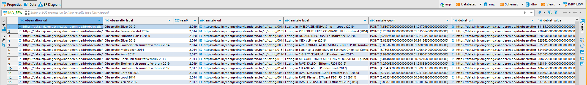
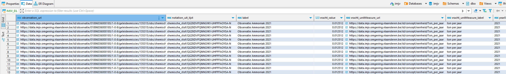

# Input data

De IMJV-data wordt bijgehouden in 2 views op het dataplatform van VMM. Achterliggend wordt de data in een datalake bijgehouden.
Dit zijn relationele tabellen en zijn opvraagbaar via SQL in Synapse.

Voor Water baseren we ons op de ERW view:

Voor Lucht baseren we ons op de EIL view:

