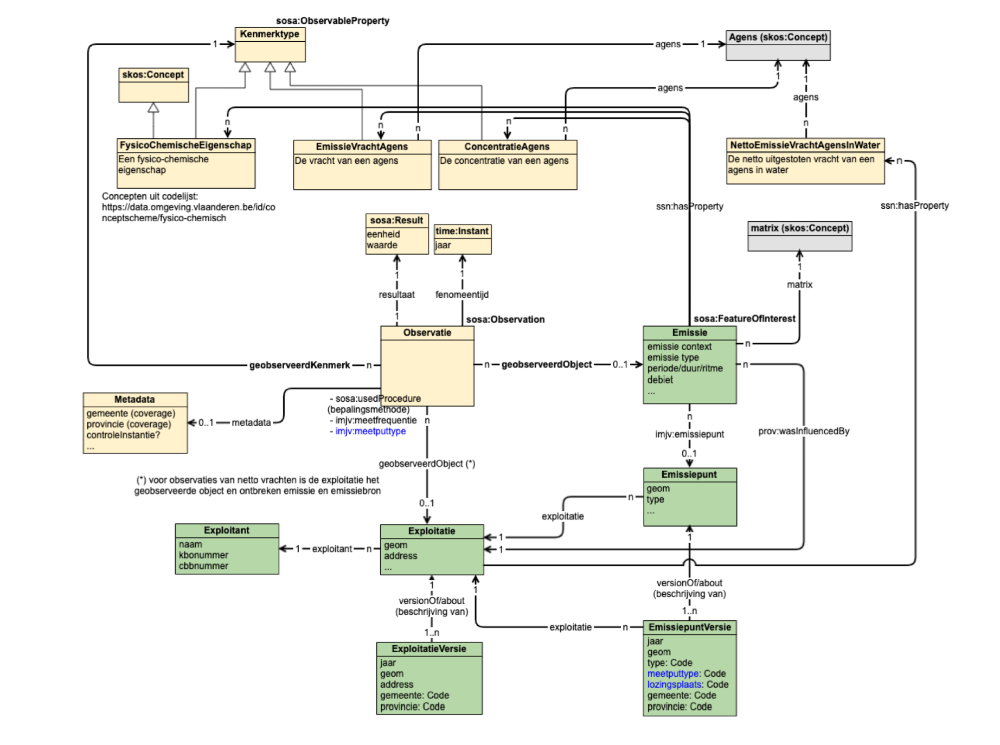

## Intro

Het OSLO model [`waterkwaliteit`](https://data.vlaanderen.be/doc/applicatieprofiel/waterkwaliteit) werd gebruikt als basis om deze dataset te converteren naar een OSLO compliant dataset.

Concreet werden volgende klasses gebruikt, maar gemapt op SSN/SOSA ipv ISO19156:
* Observatie (sosa:Observation)
* Kenmerktype (sosa:ObservableProperty)
* Object (sosa:FeatureOfInterest)
* Emissie (wk:Emissie)

Een uitbreiding werd gemaakt met volgende klasses:
* Emissiepunt (imjv:Emissiepunt)
* Exploitatie (imjv:Exploitatie)

Het beschrijven van jaar-specifieke versie's van Exploitaties en Emissiepunten werd gedaan met tijdsspecialisaties uit OSLO generiek (`https://data.vlaanderen.be/ns/generiek#isTijdspecialisatieVan`)

 
 

## Implementatiemodel volgens SSN/SOSA

Met dank aan departement Omgeving werd het implementatiemodel als volgt opgesteld:

Een belangrijk verschil met OSLO waterkwaliteit is dat de specifieke kenmerken en parameters (bruto vracht, concentratie, debiet...) werden uitgemodelleerd op Kenmerktype in plaats van subklasses.

## OSLO Waterkwaliteit

