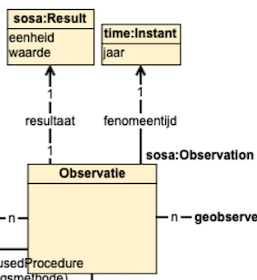
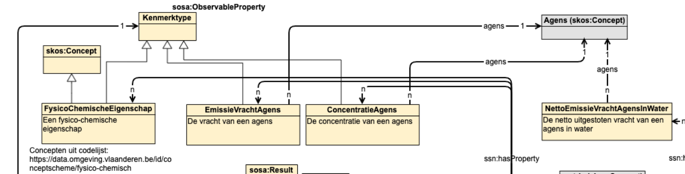
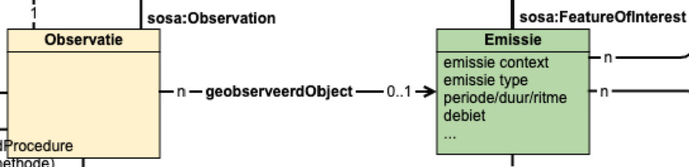

# Intro

Voor het mappen van de tabulaire view naar een Linked Data graph volgens OSLO wordt gewerkt in 2 stappen.

Eerst gebeurt een rudimentaire omzetting naar Linked Data die aansluit bij de oorspronkelijke kolomstructuur.
De reden hiervoor is dat we de OSLO mapping via SPARQL Construct queries willen uitdrukken. Dit is een leesbare manier om complexe mappingen te beschrijven, maar vereist Linked Data als input.

Daarna gebeurt een SPARQL CONSTRUCT mapping die de intiële omzetting herstructureerd in het implementatiemodel.

Om deze stappen beter uit te leggen, gaan we een water-observatie als voorbeeld uitwerken.

# Voorbeeld bruto vracht observatie water 

## Ruwe data

Om bruto vracht observaties te publiceren hebben we maar een deel van de kolommen in de view nodig:

```json
{
    "observation_url" : "https:\/\/data.imjv.omgeving.vlaanderen.be\/id\/observatie\/01894963000131\/AW9308001\/transfer\/chemische_stof\/RYGMFSIKBFXOCR-UHFFFAOYSA-N\/2021",
    "observatie_label" : "Observatie Koper 2021",
    "year0" : 2021,
    "emissie_url" : "https:\/\/data.imjv.omgeving.vlaanderen.be\/id\/lozing\/01894963000131\/AW9308001\/2021",
    "substantie_url" : "https:\/\/data.omgeving.vlaanderen.be\/id\/concept\/chemische_stof\/RYGMFSIKBFXOCR-UHFFFAOYSA-N",
    "substantie_label" : "Koper",
    "bepalingsmethode_url" : "https:\/\/data.imjv.omgeving.vlaanderen.be\/id\/concept\/meetgegevens",
    "unitMeasure_url" : "https:\/\/data.imjv.omgeving.vlaanderen.be\/id\/concept\/eenheid\/kg_per_jaar",
    "unitMeasure_label" : "kg\/jaar",
    "modifiedAt" : "2024-06-05T07:14:44.998Z",
    "isDeleted" : 0
}
```

Merk op dat kolommen `modifiedAt` en `isDeleted` ook gebruikt worden. Deze zijn domeinonafhankelijk en worden gebruikt bij het versioneren van de data.

## Intermediate mapping

Om de intermediate mapping te doen, worden volgende configuratie-velden gebruikt in de VMM-pipeline:
```yaml
  ldes_aboutbaseurl: "https://vmm.be/id/imjv/"
  ldes_aboutcolumnname: "observation_url"
  ldes_propertybaseurl: "https://vmm.be/ns#"
  ldes_membertype: "http://www.w3.org/ns/sosa/Observation"
  ldes_timestamppath: "http://www.w3.org/ns/prov#generatedAtTime"
  ldes_versionof: "http://purl.org/dc/terms/isVersionOf"
```

* `aboutbaseurl` + waarde van `aboutcolumnname` worden gebruikt om per record een URI te maken
* deze URI wordt verder geversioneerd met de huidige timestamp in de pipeline
* elke kolomwaarde leidt tot een triple met als predikaat `propertybaseurl` + naam van kolom
* een `rdf:type` triple wordt toegevoegd met als object de waarde van `membertype`
* een `versionOf` triple wordt toegevoegd met predikaat op basis van `versionof`
* een `timestamp` triple wordt toegevoegd met predikaat op basis van `timestamppath`

De eerste omzetting leidt tot volgende triples:

```turtle
<https://vmm.be/id/imjv/https%3A%2F%2Fdata.imjv.omgeving.vlaanderen.be%2Fid%2Fobservatie%2F01894963000131%2FAW9308001%2Ftransfer%2Fchemische_stof%2FRYGMFSIKBFXOCR-UHFFFAOYSA-N%2F2021/2024-06-06T07:09:38.716Z> <https://vmm.be/ns#observation_url> "https://data.imjv.omgeving.vlaanderen.be/id/observatie/01894963000131/AW9308001/transfer/chemische_stof/RYGMFSIKBFXOCR-UHFFFAOYSA-N/2021" .
<https://vmm.be/id/imjv/https%3A%2F%2Fdata.imjv.omgeving.vlaanderen.be%2Fid%2Fobservatie%2F01894963000131%2FAW9308001%2Ftransfer%2Fchemische_stof%2FRYGMFSIKBFXOCR-UHFFFAOYSA-N%2F2021/2024-06-06T07:09:38.716Z> <https://vmm.be/ns#observatie_label> "Observatie Koper 2021" .
<https://vmm.be/id/imjv/https%3A%2F%2Fdata.imjv.omgeving.vlaanderen.be%2Fid%2Fobservatie%2F01894963000131%2FAW9308001%2Ftransfer%2Fchemische_stof%2FRYGMFSIKBFXOCR-UHFFFAOYSA-N%2F2021/2024-06-06T07:09:38.716Z> <https://vmm.be/ns#year0> "2021" .
<https://vmm.be/id/imjv/https%3A%2F%2Fdata.imjv.omgeving.vlaanderen.be%2Fid%2Fobservatie%2F01894963000131%2FAW9308001%2Ftransfer%2Fchemische_stof%2FRYGMFSIKBFXOCR-UHFFFAOYSA-N%2F2021/2024-06-06T07:09:38.716Z> <https://vmm.be/ns#emissie_url> "https://data.imjv.omgeving.vlaanderen.be/id/lozing/01894963000131/AW9308001/2021" .
<https://vmm.be/id/imjv/https%3A%2F%2Fdata.imjv.omgeving.vlaanderen.be%2Fid%2Fobservatie%2F01894963000131%2FAW9308001%2Ftransfer%2Fchemische_stof%2FRYGMFSIKBFXOCR-UHFFFAOYSA-N%2F2021/2024-06-06T07:09:38.716Z> <https://vmm.be/ns#substantie_url> "https://data.omgeving.vlaanderen.be/id/concept/chemische_stof/RYGMFSIKBFXOCR-UHFFFAOYSA-N" .
<https://vmm.be/id/imjv/https%3A%2F%2Fdata.imjv.omgeving.vlaanderen.be%2Fid%2Fobservatie%2F01894963000131%2FAW9308001%2Ftransfer%2Fchemische_stof%2FRYGMFSIKBFXOCR-UHFFFAOYSA-N%2F2021/2024-06-06T07:09:38.716Z> <https://vmm.be/ns#substantie_label> "Koper" .
<https://vmm.be/id/imjv/https%3A%2F%2Fdata.imjv.omgeving.vlaanderen.be%2Fid%2Fobservatie%2F01894963000131%2FAW9308001%2Ftransfer%2Fchemische_stof%2FRYGMFSIKBFXOCR-UHFFFAOYSA-N%2F2021/2024-06-06T07:09:38.716Z> <https://vmm.be/ns#bepalingsmethode_url> "https://data.imjv.omgeving.vlaanderen.be/id/concept/meetgegevens" .
<https://vmm.be/id/imjv/https%3A%2F%2Fdata.imjv.omgeving.vlaanderen.be%2Fid%2Fobservatie%2F01894963000131%2FAW9308001%2Ftransfer%2Fchemische_stof%2FRYGMFSIKBFXOCR-UHFFFAOYSA-N%2F2021/2024-06-06T07:09:38.716Z> <https://vmm.be/ns#bepalingsmethode_label> "meetgegevens" .
<https://vmm.be/id/imjv/https%3A%2F%2Fdata.imjv.omgeving.vlaanderen.be%2Fid%2Fobservatie%2F01894963000131%2FAW9308001%2Ftransfer%2Fchemische_stof%2FRYGMFSIKBFXOCR-UHFFFAOYSA-N%2F2021/2024-06-06T07:09:38.716Z> <https://vmm.be/ns#value0> "1.44642" .
<https://vmm.be/id/imjv/https%3A%2F%2Fdata.imjv.omgeving.vlaanderen.be%2Fid%2Fobservatie%2F01894963000131%2FAW9308001%2Ftransfer%2Fchemische_stof%2FRYGMFSIKBFXOCR-UHFFFAOYSA-N%2F2021/2024-06-06T07:09:38.716Z> <https://vmm.be/ns#unitMeasure_url> "https://data.imjv.omgeving.vlaanderen.be/id/concept/eenheid/kg_per_jaar" .
<https://vmm.be/id/imjv/https%3A%2F%2Fdata.imjv.omgeving.vlaanderen.be%2Fid%2Fobservatie%2F01894963000131%2FAW9308001%2Ftransfer%2Fchemische_stof%2FRYGMFSIKBFXOCR-UHFFFAOYSA-N%2F2021/2024-06-06T07:09:38.716Z> <https://vmm.be/ns#unitMeasure_label> "kg/jaar" .

<https://vmm.be/id/imjv/https%3A%2F%2Fdata.imjv.omgeving.vlaanderen.be%2Fid%2Fobservatie%2F01894963000131%2FAW9308001%2Ftransfer%2Fchemische_stof%2FRYGMFSIKBFXOCR-UHFFFAOYSA-N%2F2021/2024-06-06T07:09:38.716Z> <https://vmm.be/ns#modifiedAt> "2024-06-05T07:14:44.998Z" .
<https://vmm.be/id/imjv/https%3A%2F%2Fdata.imjv.omgeving.vlaanderen.be%2Fid%2Fobservatie%2F01894963000131%2FAW9308001%2Ftransfer%2Fchemische_stof%2FRYGMFSIKBFXOCR-UHFFFAOYSA-N%2F2021/2024-06-06T07:09:38.716Z> <#isDeleted> "0" .

<https://vmm.be/id/imjv/https%3A%2F%2Fdata.imjv.omgeving.vlaanderen.be%2Fid%2Fobservatie%2F01894963000131%2FAW9308001%2Ftransfer%2Fchemische_stof%2FRYGMFSIKBFXOCR-UHFFFAOYSA-N%2F2021/2024-06-06T07:09:38.716Z> <http://www.w3.org/1999/02/22-rdf-syntax-ns#type> <http://www.w3.org/ns/sosa/Observation> .
<https://vmm.be/id/imjv/https%3A%2F%2Fdata.imjv.omgeving.vlaanderen.be%2Fid%2Fobservatie%2F01894963000131%2FAW9308001%2Ftransfer%2Fchemische_stof%2FRYGMFSIKBFXOCR-UHFFFAOYSA-N%2F2021/2024-06-06T07:09:38.716Z> <http://www.w3.org/ns/prov#generatedAtTime> "2024-06-06T07:09:38.716Z"^^<http://www.w3.org/2001/XMLSchema#dateTime> .
<https://vmm.be/id/imjv/https%3A%2F%2Fdata.imjv.omgeving.vlaanderen.be%2Fid%2Fobservatie%2F01894963000131%2FAW9308001%2Ftransfer%2Fchemische_stof%2FRYGMFSIKBFXOCR-UHFFFAOYSA-N%2F2021/2024-06-06T07:09:38.716Z> <http://purl.org/dc/terms/isVersionOf> <https://vmm.be/id/imjv/https%3A%2F%2Fdata.imjv.omgeving.vlaanderen.be%2Fid%2Fobservatie%2F01894963000131%2FAW9308001%2Ftransfer%2Fchemische_stof%2FRYGMFSIKBFXOCR-UHFFFAOYSA-N%2F2021> .
```

## OSLO mapping

Op basis van de intermediate omzetting kan vervolgens een OSLO mapping uitwerkt worden adhv SPARQL CONSTRUCT queries. De intermediate omzetting kan lokaal gehost worden via HTTP server om vervolgens met Comunica te transformeren.

### WHERE

Bovenstaande triples worden gebruikt als input in de WHERE-clausule:

```
CONSTRUCT {
  ...
} WHERE {
  ?obs rdf:type ?type ;
      prov:generatedAtTime ?gat ;
      dcterms:isVersionOf ?ivo .
    ?obs <https://vmm.be/ns#observation_url> ?observation_url .
    ?obs <https://vmm.be/ns#observatie_label> ?observatie_label .
    ?obs <https://vmm.be/ns#value0> ?value0 .
    ?obs <https://vmm.be/ns#year0> ?year0 .
    ?obs <https://vmm.be/ns#substantie_url> ?substantie_url .
    ?obs <https://vmm.be/ns#emissie_url> ?emissie_url .
    ?obs <https://vmm.be/ns#substantie_label> ?substantie_label .
    ?obs <https://vmm.be/ns#bepalingsmethode_url> ?bepalingsmethode_url .
    ?obs <https://vmm.be/ns#modifiedAt> ?modifiedAt .
    OPTIONAL {
      ?obs <https://vmm.be/ns#unitMeasure_url> ?unitMeasure_url .
      ?obs <https://vmm.be/ns#unitMeasure_label> ?unitMeasure_label .
    }
}
```

De bovenste drie triple "patterns" werden automatisch toegevoegd zoals hierboven vermeld op basis van configuratie van de pipeline. Deze gebruiken wij niet, omdat we gebruiken maken van de modifiedAt om een versie object te maken.

Merk op dat unitMeasure_url en unitMeasure_label op OPTIONAL staan, omdat dit leeg (NULL) kan zijn in de view .

### Prefix

Voor de leesbaarheid worden volgende prefices gebruikt:

```
PREFIX dcterms: <http://purl.org/dc/terms/>
PREFIX dc: <http://purl.org/dc/elements/1.1/>
PREFIX skos: <http://www.w3.org/2004/02/skos/core#>
PREFIX rdf: <http://www.w3.org/1999/02/22-rdf-syntax-ns#>
PREFIX csvw: <http://www.w3.org/ns/csvw#>
PREFIX vmm: <https://vmm.be/ns#>
PREFIX prov: <http://www.w3.org/ns/prov#>
PREFIX rdfs: <http://www.w3.org/2000/01/rdf-schema#>
PREFIX sosa: <http://www.w3.org/ns/sosa/>
PREFIX ssn: <http://www.w3.org/ns/ssn/>
PREFIX xsd: <http://www.w3.org/2001/XMLSchema#>
PREFIX time: <http://www.w3.org/2006/time#>
PREFIX schema: <https://schema.org/>
PREFIX imjv: <https://data.imjv.omgeving.vlaanderen.be/ns/imjv#>
PREFIX locn: <http://www.w3.org/ns/locn#>
PREFIX geosparql: <http://www.opengis.net/ont/geosparql#>
PREFIX wk: <https://data.vlaanderen.be/ns/waterkwaliteit#>
```

### CONSTRUCT

#### Versie

Nu kunnen we starten met het mappen naar OSLO.
Eerst zorgen we ervoor dat de observatie correct geversioneerd en gelabeled is.
De ?observation_url kolom wordt als persistente identificator van een observatie gebruikt en dus niet de ?obs die door de pipeline wordt ingevuld.
De bedoeling is om de Linked Data zo dicht mogelijk in de bron te houden. Dit houdt in dat de URI's van resources best worden beschreven in de view adhv `_url`
 kolommen en niet in de mapping. Het versioneren wordt hier wel in de mapping gedaan adhv de modifiedAt-waarde om te vermijden dat het aantal _url kolommen verdubbelt.

Belangrijk bij het mappen is dat de objecten van triples correct getypeerd worden: datatypes worden verrijkt met `STRDT` en bijhorende xsd type, instanties van een klasse met `URI`.

```
CONSTRUCT {
  # EmissieVrachtAgens observaties voor water
  ?observation_versie rdf:type ?type ;
    prov:generatedAtTime ?modifiedAt_with_datatype ;
    dcterms:isVersionOf ?observation ;
    rdfs:label ?observatie_vracht_label .
    ...
} WHERE {
  BIND(STRDT(?modifiedAt, xsd:dateTime) as ?modifiedAt_with_datatype)
  BIND(URI(?observation_url) as ?observation)
  BIND(URI(concat(str(?observation_url), "/", str(?modifiedAt_with_datatype))) as ?observation_versie)
  BIND(concat('Geobserveerde vracht ', ?observatie_label) as ?observatie_vracht_label)

  ...
}
```

#### Resultaat en tijd



```
CONSTRUCT {
  ...
  ?observation_versie sosa:phenomenonTime ?observation_versie_fenomeentijd ;
    sosa:hasResult ?observation_versie_result ;
    sosa:hasSimpleResult ?vracht_value_with_datatype .

  ?observation_versie_fenomeentijd a time:Instant ;
    rdfs:label ?year0 ;
    time:inXSDgYear ?year_with_datatype .

  ?observation_versie_result a schema:QuantitativeValue, sosa:Result ;
    schema:unitCode ?vracht_unitMeasure ;
    schema:unitText ?unitMeasure_label ;
    schema:value ?vracht_value_with_datatype ;
    rdfs:label ?vracht_value_label .
    ...
} WHERE {
    ...
    BIND(URI(concat(str(?observation_versie), "/fenomeentijd/0001")) as ?observation_versie_fenomeentijd) 
    BIND(URI(concat(str(?observation_versie), "/result/0001")) as ?observation_versie_result)

    BIND(STRDT(?year0, xsd:gYear) as ?year_with_datatype)
    BIND(URI(?unitMeasure_url) as ?vracht_unitMeasure)
    BIND(STRDT(?value0, xsd:decimal) as ?vracht_value_with_datatype)

    BIND(if(bound(?unitMeasure_label), concat(?value0, ' (', ?unitMeasure_label, ')'), concat(?value0, ' (eenheid onbekend)')) as ?vracht_value_label)
  ...
}
```

#### Kenmerken



```
CONSTRUCT {
  ...
  ?observation_versie sosa:observedProperty ?observed_property_emissievrachtagens .

  ?observed_property_emissievrachtagens a sosa:ObservableProperty , imjv:EmissieVrachtAgens ;
              wk:agens ?agens ;
              rdfs:label ?observed_property_emissievrachtagens_label ;
              rdfs:comment ?observed_property_emissievrachtagens_comment .
            
            ?agens a skos:Concept ;
              rdfs:label ?substantie_url_with_lang .
    ...
} WHERE {
    ...
    BIND(URI(str(?substantie_url)) as ?agens)
    BIND(STRLANG(?substantie_url, "nl") as ?substantie_url_with_lang)

    BIND(STRLANG(concat("vracht ", ?substantie_label), "nl") as ?observed_property_emissievrachtagens_label)
    BIND(STRLANG(concat("De vracht ", ?substantie_label, " van een emissie."), "nl") as ?observed_property_emissievrachtagens_comment)
  ...
}
```

#### Geobserveerd Object




```
CONSTRUCT {
  ...
  ?observation_versie sosa:hasFeatureOfInterest ?emissie .
    ...
} WHERE {
  ...
  BIND(URI(?emissie_url) as ?emissie)
  ...
}
```