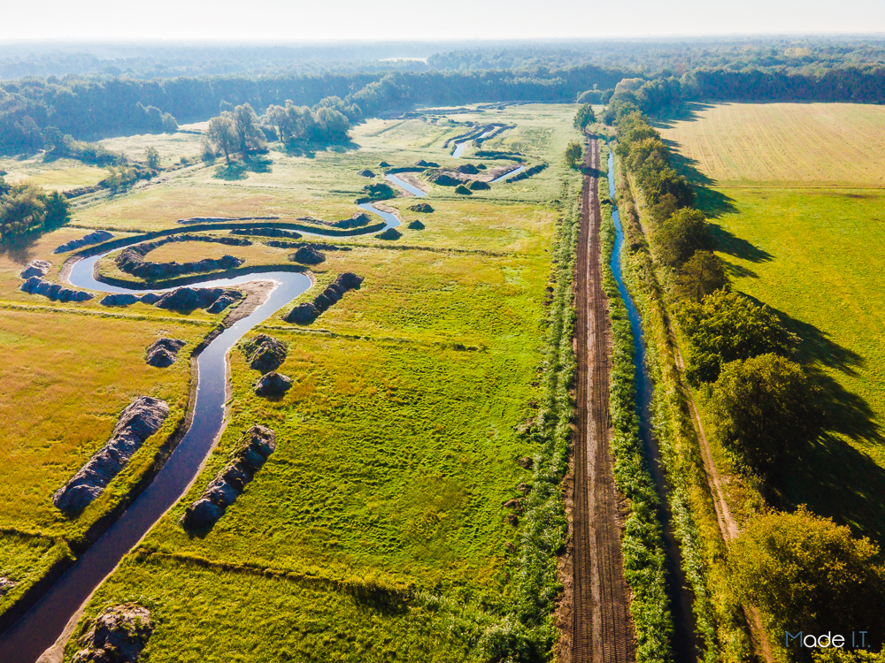

# VMM

Tijdens het OSLO traject van het OSLO model `waterkwaliteit`(https://data.vlaanderen.be/doc/applicatieprofiel/waterkwaliteit/) werden verschillende datasets als implementatievoorbeeld gebruikt, waaronder de dataset van waterkwaliteit in de Warmbeek.

In november 2022 zijn de werken aan de Warmbeek in Hamont-Achel ter hoogte van de Achelse Kluis afgerond. Het gaat om een hermeandering over een lengte van ongeveer 1,7 km. Dit project herstelt de natuurlijke waterberging in de vallei en creëert typische beekhabitats voor een soortenrijk en zeldzaam visbestand.

In het verleden werd de Warmbeek ter hoogte van de Achelse Kluis rechtgetrokken, ingedijkt en opgestuwd. Hierdoor verdwenen meanders en overstromingen in het valleigebied. Dankzij de hermeandering functioneert dit gebied opnieuw als een overstroombare vallei die extra water buffert. Zo verminderen piekafvoeren stroomafwaarts.

