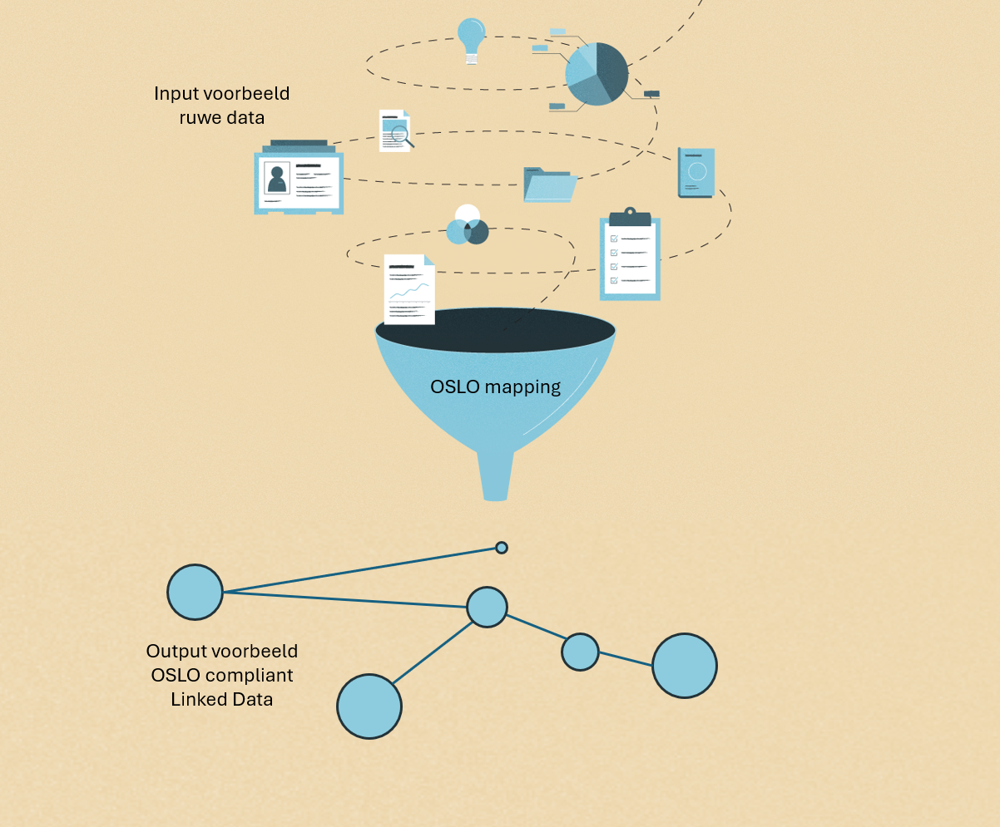

# OSLO mapping

In deze documentatie vindt u de benodigde bronnen en instructies om ruwe datasets naadloos om te zetten in OSLO-conforme gegevens. Deze documentatie heeft als doel het proces te vereenvoudigen en ervoor te zorgen dat uw gegevens in overeenstemming zijn met de normen en praktijken die door OSLO zijn vastgesteld.

